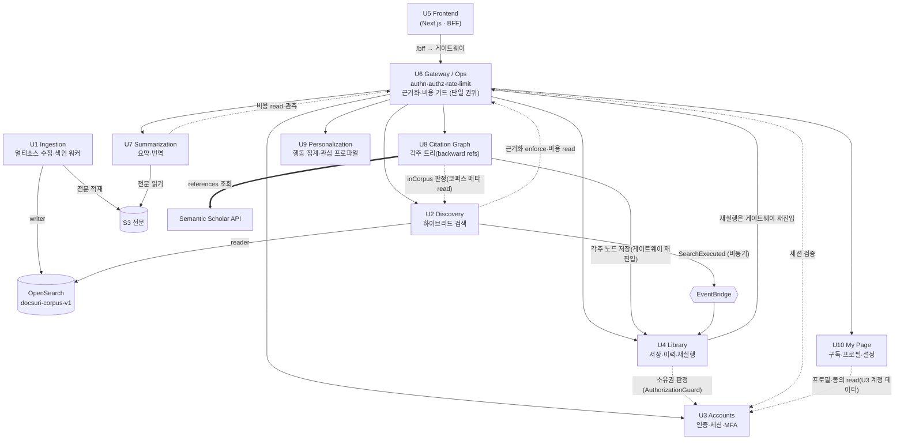

# DocSuri 유닛 파이프라인 문서 (U1~U10)

> 유닛(U1~U10)별 단락으로 구분한다. 각 단락에 **파이프라인 + 스택 요약**이 들어간다.
> 각 단락은 그 유닛의 **대표 경로 1건**(색인 1건 · 검색 1회 · 로그인 1회 · 요약 1회 …)을 끝까지 따라간다.
> 근거: `backend/modules/<unit>/` · `ingestion/` · `frontend/` · `ops/` 실제 코드 + `shared/` 계약 + `aidlc-docs/`.
> 본문의 모든 수치(top_k=150·RRF_K=60·top_n=20·캐시 TTL 등)는 **코드 상수 그대로**다 — 추정값이 아니다.
>
> **읽는 법:** 박스(`╔═╗`) = 한 유닛의 도메인 코어 / `[ ... ]` = 외부 인프라·다른 유닛 / `★` = 폴백·게이트 등 분기점 / 굵은 화살표(`──▶`) = 외부 호출.

## 유닛 한눈에
| 유닛 | 한 줄 | 경로 성격 | 핵심 불변식 |
|---|---|---|---|
| **U1** Ingestion | arXiv 수집·청킹·임베딩·색인 | 비동기 워커 — **처리량** | 단일 **writer** · 멱등 색인 |
| **U2** Discovery | 자연어 하이브리드 검색 | 동기 — **레이턴시**(P50<3s) | 단일 **reader** · 근거화는 U6 |
| **U3** Accounts | 인증·세션·MFA | FastAPI async | 토큰 쿠키 전용 · fail-closed |
| **U4** Library | 저장·이력·재실행 | 동기 CRUD + 이벤트 소비 | owner 스코프 · 백도어 금지 |
| **U5** Frontend | 검색·라이브러리 폰 UI | Next.js BFF | 토큰 브라우저 비노출 |
| **U6** Reliability | 게이트웨이·근거화·비용 가드 | 엣지 미들웨어 + 운영 워커 | 횡단 관심사 **단일 권위** |
| **U7** Summarization | 온디맨드 구조화 요약·번역 | 동기 — 캐시 우선 | 불변 캐시 키 · U7 자체 근거화 |
| **U8** Citation Graph | 상세보기 각주 트리(backward refs) | 동기 — 온디맨드·비-SLA | 외부 provider 캐시 · 코퍼스 밖 노드 |
| **U9** Personalization | 행동 이벤트 집계·관심 프로파일 | 동기 read-port + 보존 잡 | opt-in · 저하 시 빈 결정 |
| **U10** My Page | 마이페이지(구독·프로필·설정·관심논문) | 동기 CRUD · 폰 셸 | owner 스코프 · 구독 mock |

## 유닛 의존성 그래프

> 실선(`──▶`) = 요청·데이터가 흐르는 방향 / 점선(`-.->`) = 단일 권위를 **호출/조회만**(재구현 안 함) / 원통 = 공유 스토어.
> 읽는 핵심: **U6가 모든 요청의 길목**이고(횡단 관심사 단일 권위), **U1=writer / U2=reader가 같은 인덱스**를 공유한다.



---

# U1 Ingestion

멀티소스 Corpus 수집(arXiv + Semantic Scholar + OpenAlex) · 청킹 · 문서 임베딩 · 색인 (공유 인덱스 단일 **writer**).
cross-source로 정규 논문 1건을 만들고 doc-model을 **색인 전 eager**로 빌드한다(phase-1 Corpus).
**비동기 워커**(레이턴시가 아니라 처리량이 목표 — U2의 동기 경로와 정반대). 아래는 논문 1건 색인 경로.

## 파이프라인

```
┌──────────────────────────────────────────────────────────────────────────────────────┐
│  TRIGGER         RefreshOrchestrationService   enabled_sources = arXiv [+ S2 · OpenAlex] │
│   · on_schedule_tick (소스별 watermark 이후 증분)  · on_new_arxiv_event  · trigger_full_rebuild(락) │
│   · arXiv = harvest_seed/fetch_incremental   · 외부 소스 = source_record로 enqueue        │
│   · 코퍼스 범위: cs.LG/AI/CL/CV · stat.ML · 2025년               │  IngestionJob 적재 → 큐  │
└─────────────────────────┼──────────────────────────────────────────────────────────────┘
                          ▼
┌──────────────────────────────────────────────────────────────────────────────────────┐
│  QUEUE           [ AWS SQS 큐 ]   rebuild 진행 중이면 증분/이벤트 defer                     │
│   worker.py: receive_messages(max 10) → process_message                                 │
│     └ kind=BUILD_DOC_MODEL → build_doc_model · source_record 있음 → 외부 소스 · 그 외 → arXiv │
└─────────────────────────┼──────────────────────────────────────────────────────────────┘
                          ▼
╔════════ U1 도메인 코어 (IngestionPipelineService.ingest_one · Python 워커 · 비동기) ════════╗
║  공통 복원력(의존성 호출마다): retry 5회(지수 backoff+jitter) · circuit(5회 OPEN·60s) · timeout 30s ║
║                                                               stack / 수치               ║
║  ┌────────────────────────────────────────────────┐                                      ║
║  │ ① START                record_job_started        │─────────────────▶ [ PostgreSQL 컨트롤플레인 ] ║
║  └───────────────────────┬────────────────────────┘                                      ║
║                          ▼                                                                ║
║  ┌────────────────────────────────────────────────┐      ┌──────────────────────────┐    ║
║  │ ② FETCH                소스별 원문 수집            │ arXiv│ arXiv HTTP               │    ║
║  │   arXiv:  fetch_metadata + fetch_full_text      │─────▶│                          │    ║
║  │   외부소스(source_record): PDF → GROBID 전문추출  │─────▶│ Semantic Scholar/OpenAlex│    ║
║  │                                                 │ ext  │   + GROBID               │    ║
║  └───────────────────────┬────────────────────────┘      └──────────────────────────┘    ║
║                          ▼                                                                ║
║  ┌────────────────────────────────────────────────┐                                      ║
║  │ ③ PARSE / GATE         FetchParseProcessor       │  OA 라이선스 allowlist               ║
║  │   라이선스 위반 → ★거부(skip)                    │  (CC-BY·BY-SA·CC0 + arXiv            ║
║  │   withdrawal 마커 → ★tombstone ──────────────────────────▶ [ OpenSearch ] tombstone_paper ║
║  └───────────────────────┬────────────────────────┘   nonexclusive-distrib ≈ 대부분 arXiv)  ║
║                          ▼                                                                ║
║  ┌────────────────────────────────────────────────┐                                      ║
║  │ ④ DEDUP (cross-source) canonical dedup           │─────────────────▶ [ PostgreSQL ]    ║
║  │   key=title+year+(doi·arxivId)+first_author      │  소스 우선순위                       ║
║  │   ★더 높은 소스 → 기존 winner tombstone·교체      │  arXiv < S2 < OpenAlex               ║
║  │   ★낮은 소스 → DUPLICATE / 낮은 버전 → STALE 종료 │                                      ║
║  └───────────────────────┬────────────────────────┘                                      ║
║                          ▼                                                                ║
║  ┌────────────────────────────────────────────────┐                                      ║
║  │ ⑤ CLAIM                begin_upsert (단조 가드)   │  낮은 버전 거부                      ║
║  └───────────────────────┬────────────────────────┘                                      ║
║                          ▼                                                                ║
║  ┌────────────────────────────────────────────────┐                                      ║
║  │ ⑥ STORE FULL-TEXT      put_full_text             │─────────────────▶ [ AWS S3 전문 저장 ] ║
║  └───────────────────────┬────────────────────────┘                                      ║
║                          ▼                                                                ║
║  ┌────────────────────────────────────────────────┐                                      ║
║  │ ⑦ DOC-MODEL + CHUNK    eager 빌드(색인 전)        │  native HTML → PDF/text 폴백         ║
║  │   chunk_doc_model(블록 단위·block_refs) │ 폴백=chunk│  max 2400자·overlap 240·≤128청크    ║
║  └───────────────────────┬────────────────────────┘                                      ║
║                          ▼                                                                ║
║  ┌────────────────────────────────────────────────┐      ┌──────────────────────────┐    ║
║  │ ⑧ EMBED                embed_documents           │─────▶│ AWS Bedrock              │    ║
║  │   (단일 writer 공간 · U2 reader와 동일)           │      │ Cohere Embed v4 (Bedrock)│    ║
║  │                                                 │◀─────│ search_document·1024-d·cosine │ ║
║  └───────────────────────┬────────────────────────┘      └──────────────────────────┘    ║
║                          ▼                                                                ║
║  ┌────────────────────────────────────────────────┐                                      ║
║  │ ⑨ ASSEMBLE             IndexRecord               │  chunkId=결정적 upsert키             ║
║  │                                                 │  lexicalTerms(제목+초록+청크)·카드필드 ║
║  └───────────────────────┬────────────────────────┘                                      ║
║                          ▼                                                                ║
║  ┌────────────────────────────────────────────────┐                                      ║
║  │ ⑩ INDEX                bulk_upsert               │─────────────────▶ [ OpenSearch       ║
║  │   + delete_stale_chunks (paperId 단위)           │                    docsuri-corpus-v1 ] ║
║  └───────────────────────┬────────────────────────┘                                      ║
║                          ▼                                                                ║
║  ┌────────────────────────────────────────────────┐                                      ║
║  │ ⑪ COMMIT  mark_ingested · advance_watermark(소스별)│ record_canonical_winner            ║
║  │           record_job_finished                    │ · job 종료                          ║
║  └───────────────────────┬────────────────────────┘                                      ║
╚══════════════════════════╪═══════════════════════════════════════════════════════════════╝
        │ 성공 → SQS ack                          │ 실패(IngestionError)
        ▼                                         ▼
   다음 메시지                          record_job_finished(False) → emit_failure_signal
                                        ★PERMANENT → [ SQS DLQ ] + ack  /  ★RETRIABLE → 미ack(재배달)

  ─────────── 색인 핫패스 밖의 갈래 (색인을 절대 막지 않음) ───────────
   ⑩' (선택) dual-write v2  : embedding_v2+vector_index_v2 주입 시 다른 모델로 두 번째 인덱스
                              (모델 마이그레이션/AB) — best-effort, 실패=로그만(1차 색인 무영향)
   ⑪  FR-17 assets         : 그림/표 추출 → S3, 인덱스 커밋 *후* best-effort(BR-27)
   BUILD_DOC_MODEL 잡(호환/백필) : doc-model 누락·재빌드분만 lazy 생성·캐시(결정적, native HTML→PDF 폴백)
                              메인 경로의 ⑦ eager 빌드가 표준 — 이 잡은 누락·백필 보강용(D6/BR-30)
```

## 스택 요약

| 레이어 | 기술 | 메모 |
|---|---|---|
| **런타임** | Python 워커 (long-running, SIGTERM drain) | 비동기·처리량 목표, 사용자 경로 밖 |
| **큐** | AWS SQS (+ DLQ) | 외부 인프라 접점 — at-least-once, PERMANENT만 DLQ |
| **소스** | arXiv HTTP · Semantic Scholar · OpenAlex (+ GROBID PDF 추출) | 외부 인프라 접점 — cross-source, 소스별 watermark·우선순위 |
| **컨트롤 플레인** | PostgreSQL | canonical dedup·소스별 watermark·job 상태·rebuild 락 (단조 가드) |
| **전문 저장** | AWS S3 | 외부 인프라 접점 — 원문 보관 |
| **임베딩** | AWS Bedrock — Cohere Embed v4 (`search_document`, 1024-d·cosine, specVersion v2) | 권한 경계 — 단일 writer, U2 reader와 동일 공간 |
| **색인 스토어** | OpenSearch `docsuri-corpus-v1` (+ 선택 v2 인덱스) | 권한 경계 — 단일 writer(U2=단일 reader), v2는 dual-write best-effort |
| **doc-model/assets** | docmodel 빌더(native HTML→PDF/text) · S3 그림/표 | ⑦ eager 빌드가 표준(블록 단위 청킹) · BUILD_DOC_MODEL=백필, assets best-effort, U7이 소비 |
| **복원력** | retry 5회 · circuit(5/60s) · timeout(기본 30s·설정값) | 의존성별 독립, 처리량 자세 |

---

# U2 Discovery

자연어 검색 · 하이브리드(벡터+BM25) 검색 · 근거화 결과 (공유 인덱스 단일 **reader**).

## 파이프라인

```
┌──────────────────────────────────────────────────────────────────────────────────────┐
│  CLIENT          [ U5 폰 앱 — Next.js (App Router) · 폰 목업 UI ]                        │
│                         │  POST /api/search  { "query": "그래프 신경망 추천" }           │
└─────────────────────────┼──────────────────────────────────────────────────────────────┘
                          ▼
┌──────────────────────────────────────────────────────────────────────────────────────┐
│  GATEWAY         [ U6 Gateway ]   authn · authz · rate-limit  ──▶ RequestContext(userId)│
└─────────────────────────┼──────────────────────────────────────────────────────────────┘
                          ▼
╔════════════════════ U2 도메인 코어 (FastAPI · Python · 동기) ═══ NFR-P1: P50 < 3s ═══════╗
║                                                                                          ║
║   plan_and_retrieve()                                          stack / 수치              ║
║  ┌────────────────────────────────────────────────┐                                      ║
║  │ ① VALIDATE / NORMALIZE   QueryValidator         │  NFC · ≤500자 · 제어문자 거부        ║
║  │    실패 → ValidationErrorDTO ─────────────────────────────────────▶ HTTP 400          ║
║  └───────────────────────┬────────────────────────┘                                      ║
║                          ▼                                                                ║
║  ┌────────────────────────────────────────────────┐                                      ║
║  │ ② DEGRADE 파생          CostGuard.getBudgetState│  U6 읽기전용 (U2는 판정 안 함)       ║
║  │    NORMAL / RERANK_OFF / LEXICAL_ONLY           │                                      ║
║  └───────────────────────┬────────────────────────┘                                      ║
║                          ▼                                                                ║
║  ┌────────────────────────────────────────────────┐      ┌──────────────────────────┐    ║
║  │ ③ EXPAND               QueryUnderstandingExpander│─────▶│ EmbeddingCache (TTL=300s) │    ║
║  │    · lexical terms = lower().split()            │ miss │  key=정규화질의           │    ║
║  │    · query embedding (llm_enabled일 때만)       │◀─────│  max=1024, oldest evict   │    ║
║  └───────────────────────┬────────────────────────┘      └─────────────┬────────────┘    ║
║                          │                                              ▼ miss            ║
║                          │                              ┌────────────────────────────┐    ║
║                          │                              │ AWS Bedrock                 │    ║
║                          │                              │ Cohere Embed v4 (Bedrock)   │    ║
║                          │                              │ input_type=search_query     │    ║
║                          │                              │ 1024-d · cosine · 정규화     │    ║
║                          │   임베딩 장애                 └────────────────────────────┘    ║
║                          │   EmbeddingUnavailable ──▶ ★폴백: lexical-only (DegradedDTO)    ║
║                          ▼                                                                ║
║  ┌────────────────────────────────────────────────┐                                      ║
║  │ ④ RETRIEVE             HybridRetriever          │                                      ║
║  │                                                 │      ┌──────────────────────────┐    ║
║  │   k-NN 쿼리  ∥  BM25 쿼리   (병렬 발행)          │─────▶│ OpenSearch               │    ║
║  │   각 top_k=150                                  │      │ index: docsuri-corpus-v1 │    ║
║  │        │                                        │◀─────│ ─ vector: knn_vector     │    ║
║  │        ▼                                        │      │     hnsw·cosinesimil·1024│    ║
║  │   RRF 병합   score=Σ 1/(60 + rank + 1)          │      │ ─ lexicalTerms: text(BM25)│    ║
║  │   RRF_K=60 · 점수 스케일 무관                    │      │ (k-NN·BM25 단일 스토어)   │    ║
║  │        ▼                                        │      └──────────────────────────┘    ║
║  │   디덥 (paperId 단위, first-seen)               │  장애 → IndexUnavailable             ║
║  │   정렬 (-score, paperId)                        │        ★fail-closed ─▶ HTTP 503       ║
║  │                                                 │                                      ║
║  │   후보 0건/필터아웃 → 빈 페이지(resultCount=0) ──────────────▶ HTTP 200 (★abstain 아님)║
║  └───────────────────────┬────────────────────────┘                                      ║
║                          ▼                                                                ║
║  ┌────────────────────────────────────────────────┐                                      ║
║  │ ⑤ RANK                 RelevanceRanker          │  sort(-score) → top_n=20 절단        ║
║  │    LLM 리랭킹 없음(baseline) · 안정 정렬          │  (RERANK_OFF는 no-op)               ║
║  └───────────────────────┬────────────────────────┘                                      ║
║                          ▼                                                                ║
║  ┌────────────────────────────────────────────────┐                                      ║
║  │ ⑥ toGroundingInput     GroundingAdapter         │  GroundingInput{후보 + 실재 레코드}  ║
║  └───────────────────────┬────────────────────────┘                                      ║
╚══════════════════════════╪═══════════════════════════════════════════════════════════════╝
                           ▼   ── gateway seam (INV-1) ──
              ┌──────────────────────────────────────────────┐
              │ ★ ENFORCE   [ U6 GroundingEnforcementHook ]   │  ← U2는 절대 직접 호출 안 함
              │   날조 검증 → GroundingDecision(verdict)       │     (단일 호출 지점 = U6)
              └─────────────────────┬────────────────────────┘
                                    ▼
╔══════════════════════════ U2 도메인 코어 (이어서) ═══════════════════════════════════════╗
║   finalize()                                                                             ║
║  ┌────────────────────────────────────────────────┐                                      ║
║  │ ⑦ mapDecision          GroundingAdapter         │  pass → Grounded                     ║
║  │                                                 │  block/abstain → AbstainResult       ║
║  └───────────────────────┬────────────────────────┘                                      ║
║                          ▼                                                                ║
║  ┌────────────────────────────────────────────────┐                                      ║
║  │ ⑧ ASSEMBLE             ResultAssembler          │  카드 7필드만 (SEC-9)                ║
║  │    title·authors·year·arxivId·snippet·          │  relevance=순위(raw 점수 비노출)     ║
║  │    relevance·arxivUrl                           │  저하 시 → DegradedResultDTO(mode)   ║
║  └───────────────────────┬────────────────────────┘                                      ║
║                          ▼                                                                ║
║                  SearchResponse (4종단 중 1) ─────────────────────────────▶ HTTP 200      ║
║                          │                                                                ║
║  ┌───────────────────────┴────────────────────────┐                                      ║
║  │ ⑨ PUBLISH (응답 후 · 비차단 · fire-and-forget)   │  실패해도 응답 무영향                ║
║  └───────────────────────┬────────────────────────┘                                      ║
╚══════════════════════════╪═══════════════════════════════════════════════════════════════╝
                           ▼
              [ AWS EventBridge ]  Source=docsuri.discovery / SearchExecuted
                           ▼
              [ U4 Library ]  SearchHistoryEventConsumer → record_search()
                           ▼
              [ PostgreSQL (RDS) ]  search_history (owner_id·query·executed_at·result_count)

  ─────────── 곁다리: 논문 상세 메타 (U5 상세 페이지 · U7 요약 진입점) ───────────
   GET /api/papers/{paperId}  → PaperMetadataService.get_paper_meta (코퍼스 데이터=U2 소유)
     · paper_service 주입됐을 때만 라우트 등록  · 없으면 404
```

## 스택 요약

| 레이어 | 기술 | 메모 |
|---|---|---|
| **API** | FastAPI · pydantic v2 · Python 3.12 | 동기 단일 경로, NFR-P1 P50<3s |
| **임베딩** | AWS Bedrock — Cohere Embed v4 (1024-d, cosine, `search_query`, specVersion v2) | 외부 인프라 접점 — 비용·레이턴시 동인 / 장애 시 lexical 폴백 |
| **캐시** | 인메모리 read-through, TTL 300s, max 1024 (→ Infra: 공유 캐시) | 중복 질의 임베딩 차단 |
| **검색 스토어** | OpenSearch — k-NN(HNSW·cosine·1024) + BM25, 단일 인덱스 `docsuri-corpus-v1`, 각 top_k=150 | 외부 인프라 접점 / 장애 시 503 fail-closed (폴백 없음) |
| **병합** | 앱 레벨 RRF (k=60) — 리스트내 best-chunk(MAX)→리스트간 SUM + paperId 디덥 | 점수 스케일 무관·결정적, 전문 길이 편향 차단 |
| **근거화** | U6 GroundingEnforcementHook (gateway seam 단일 호출) | 권한 경계 — 이 행만 U2 밖(U6), 검색 ≠ 근거화 |
| **이벤트** | AWS EventBridge → U4 → PostgreSQL(RDS) `search_history` | 외부 인프라 접점 — 비동기·비차단, 검색 응답과 분리 |
| **저하 권위** | U6 CostGuardCircuitBreaker (U2는 읽기만) | 권한 경계 — 비용 판정은 U6, U2는 분기만 |

---

# U3 Accounts

인증 · 계정 · 세션 (TOTP · reCAPTCHA · 비밀번호). **FastAPI async**. 아래는 로그인(US-A2) 경로.

## 파이프라인

```
  [ U5 ] ──POST /auth/login { email, password } (+ X-Recaptcha-Token)──▶ [ U6 Gateway ]
                                                                              ▼
╔════════════════ AuthenticationService.authenticate (async) ════════════════╗
║  ① get_by_email ──────────────────────────────────────▶ [ PostgreSQL 계정 ]  ║
║  ② failure_count ≥ 10 → reCAPTCHA 강제 ────────────────▶ [ reCAPTCHA ]        ║
║     실패 → DomainException (fail-closed)                                      ║
║  ③ 비밀번호 비교 (constant-time)                                              ║
║     · Argon2id (m=64MB·t=3·p=4) — CPU 바운드라 asyncio.to_thread (이벤트루프 비차단) ║
║     · 계정 없으면 dummy_hash로 동일시간 비교 (타이밍 공격·부존재 은닉)            ║
║  ④ 실패 시: failure_count++ → 3회차부터 지수 backoff(1·2·4…최대 120s)          ║
║     · asyncio.sleep(비차단) · AuthFailureSignal emit(일반화 reason만) · 401     ║
║  ⑤ status 검증: PENDING(메일 미인증)·LOCKED(관리자 수동) → 거부                  ║
║  ⑥ 성공: failure 통계 리셋 · needs_rehash면 Argon2 재해시                       ║
║  ⑦ Principal(role=DB값 · mfa_verified=False) 생성                              ║
║  ⑧ SessionManager.issue: token_hex(32) ───────────────▶ [ Redis 세션 ]        ║
║     · sliding 2h(idle) · absolute 30d                                         ║
╚══════════════════════════════╪══════════════════════════════════════════════╝
                               ▼
   controller: Set-Cookie session_id (httpOnly · secure · samesite=lax · 30d)
   응답 body = { status, message }  ← 토큰은 body에 없음 (SEC-12)

  ─────────── 이후 요청 인증 (GET /auth/session, /library/*, /api/search) ───────────
   쿠키 session_id ──▶ SessionManager.verify ──▶ [ Redis get ]
     · sliding/absolute 만료 검사 → 갱신   · Redis 장애 → fail-closed(401, DB 폴백 안 함)
     → Principal(role·mfa_verified) 복원

  ─────────── 관리자 제어평면 (BR-A7) ───────────
   /auth/mfa/verify: TOTP 코드 검증 → session elevate_mfa(mfa_verified=True)
   /auth/admin/*: AuthorizationGuard.authorize_admin(role=ADMIN AND mfa_verified) → 아니면 403
```

## 스택 요약

| 레이어 | 기술 | 메모 |
|---|---|---|
| **API** | FastAPI (async) · Python | /auth/* 라우터 |
| **계정 저장** | PostgreSQL (CredentialRepository) | 계정·해시·실패 통계 |
| **세션 저장** | Redis (SessionRepository, 풀 싱글톤) | sliding 2h / absolute 30d · 장애 시 fail-closed |
| **비밀번호** | Argon2id (m=64MB·t=3·p=4) | constant-time + 워커 스레드 + 자동 rehash |
| **봇/남용 방어** | reCAPTCHA + 지수 backoff | 10회차 CAPTCHA, 자동 LOCKED 금지 |
| **MFA** | TOTP (관리자 전용, BR-A7) | role=ADMIN AND mfa_verified → 제어평면 |
| **인가** | AuthorizationGuard (단일 권위) | 권한 경계 — deny-by-default, 403 |
| **세션 전달** | httpOnly 쿠키 (secure·samesite=lax) | 권한 경계 — 토큰 body 비노출(SEC-12) |

---

# U4 Library

라이브러리(논문 저장) · 검색 이력 · 저장된 검색. **FastAPI 동기 CRUD + 이벤트 소비자**.
세 갈래: ⓐ CRUD · ⓑ 검색 이력 적재(U2 이벤트) · ⓒ 재실행(게이트웨이 재진입).

## 파이프라인

```
ⓐ CRUD (saved-searches / library / history)  — 동기, owner 스코프
  [ U5 ] ──▶ [ U6 Gateway ] ──(request.state.principal 주입)──▶ controller.get_principal
                                                                  │  없으면 401(fail-closed)
                                                                  ▼
   LibraryService / SavedSearchService / SearchHistoryService
     · library.add: (owner, arxivId) 멱등 · 쿼터 1000/owner · 검증된 meta 스냅샷 보존
     · mutate 시 authorize_owned (U3 AuthorizationGuard) — 타인/부재 → 404 (SEC-9)
     · list: keyset(커서) 페이지네이션 — 오프셋·총건수 없음
                                                                  ▼
   [ PostgreSQL (RDS, SQLAlchemy) ]  saved_searches · library_items · search_history
     (mock-first: InMemoryUserDataRepository — 인프라 없이 mount)

ⓑ 검색 이력 적재  — 비동기, 검색 응답 경로 밖
  [ U2 ] publishSearchExecuted ──▶ [ AWS EventBridge ] ──▶ SearchHistoryEventConsumer.consume
     → record_search (dedupe_key 멱등) ──▶ [ PostgreSQL ] search_history

ⓒ 재실행 (saved-search/history rerun)  — INV-L2 (백도어 금지)
  controller ──▶ SearchGatewayPort.search(query, principal)
     ※ U2 직접 호출 금지 → [ U6 Gateway ] 재진입 → U2 (비용 가드·근거화 enforce 재적용)
     (현재 StubSearchGateway 자리표시 — 실 게이트웨이 결선은 동일 포트 뒤 교체)
```

## 스택 요약

| 레이어 | 기술 | 메모 |
|---|---|---|
| **API** | FastAPI (동기 CRUD) · 3 라우터 | saved-searches / library / history |
| **저장소** | PostgreSQL (RDS, SQLAlchemy) / InMemory(mock) | keyset 커서, 1:1 마이그레이션 매핑 |
| **인가** | U3 AuthorizationGuard (위임) | 권한 경계 — owner 스코프(INV-L1), 타인→404 |
| **이력 입력** | AWS EventBridge → SearchHistoryEventConsumer | 외부 인프라 접점 — 비동기, dedupe_key 멱등 |
| **재실행** | SearchGatewayPort → U6 Gateway → U2 | 권한 경계 — 백도어 금지(INV-L2), 비용·근거화 재적용 |
| **무결성** | meta 스냅샷 · (owner,arxivId) 멱등 · 쿼터 1000 | availability isolation |

---

# U5 Frontend

검색 화면(히어로) · 라이브러리/이력/저장된 검색 · 폰 목업 UI.
**실측 스택: Next.js(App Router) · React · TypeScript** (※ "React Native"가 아니라 폰 목업으로 렌더하는 웹 앱).
아래는 **검색(hero) 경로** — U2까지 어떻게 도달하는지.

## 파이프라인

```
┌──────────────────────────────────────────────────────────────────────────────────────┐
│  BROWSER (Client Component)   [ SearchScreen.tsx ]                                       │
│   상태기계: idle → loading → outcome | error    in-flight 락(useRef · 중복 제출 차단)     │
│   ① validateQuery(): NFC + trim · ≤500자 (클라 검증 = UX 보조 · 권위는 백엔드)            │
│       실패 → inlineError 표시 (요청 미전송)                                              │
└─────────────────────────┼──────────────────────────────────────────────────────────────┘
                          ▼  getApiClient().search(query)
┌──────────────────────────────────────────────────────────────────────────────────────┐
│  ApiClient.search()   [ lib/api/apiClient.ts ]   — 백엔드 단일 진입점                    │
│   POST /api/search { query } · idempotent=true                                          │
│   정책: timeout=8000ms · idempotent만 1회 재시도(최대 2회 시도·5xx/네트워크·backoff 200ms×i) · in-flight dedup(키 단위) │
│   200/400 → classify · 그 외 → normalizeHttpError(UserFacingError)                       │
└─────────────────────────┼──────────────────────────────────────────────────────────────┘
                          ▼  Transport.send()  (팩토리가 빌드 플래그로 선택)
            ┌─────────────────────────────────────┬─────────────────────────────────────┐
            ▼ NEXT_PUBLIC_DOCSURI_REAL_API 설정 시   ▼ (기본값 = mock)
   ┌──────────────────────────────────┐    ┌──────────────────────────────────┐
   │ RouteHandlerTransport            │    │ MockTransport                    │
   │ fetch /bff/api/search (동일 출처) │    │ 인-브라우저 픽스처(searchFixtures)│
   │ credentials=same-origin·no-store │    │ → 즉시 SearchResponse 반환        │
   │ httpOnly 세션 쿠키 자동 첨부       │    └──────────────────────────────────┘
   └────────────────┬─────────────────┘
                    ▼
╔══════════════ BFF (Next 서버)  [ app/bff/[...path]/route.ts ] ════════════════════════╗
║  서버 전용 seam — 게이트웨이 URL·세션 쿠키는 여기서만 보인다 (SEC-3/12)                  ║
║   DOCSURI_GATEWAY_URL 있음 → HttpTransport (server-only · 쿠키 헤더 전달)               ║
║   없음               → MockTransport (인프라 없이 프리뷰)                                ║
║   업스트림 Set-Cookie를 브라우저로 릴레이                                                ║
╚═════════════════════════╪══════════════════════════════════════════════════════════════╝
                          ▼  HttpTransport.send() · cache no-store · cookie 헤더 전달
              [ U6 Gateway ]  authn · authz · rate-limit
                          ▼
              [ U2 Discovery ]  ← 위 U2 파이프라인 그대로
                          │  SearchResponse (4종단)
                          ▼
┌──────────────────────────────────────────────────────────────────────────────────────┐
│  classifySearchResponse()   [ lib/api/classify.ts ] — 구조로 union 판별(판별 필드 없음)  │
│   { reason } → abstain          { cards, meta, mode } → degraded                         │
│   { cards, meta } → page (meta.resultCount=0 이면 empty)     { message } → invalid       │
└─────────────────────────┼──────────────────────────────────────────────────────────────┘
                          ▼  SearchOutcome
┌──────────────────────────────────────────────────────────────────────────────────────┐
│  SearchScreen 렌더 분기                                                                  │
│   page → ResultList · degraded → ResultList(저하 배너) · empty/abstain/invalid → StateView│
│   에러: 401(auth) → /login?redirect=/search · 그 외 → StateView(error) + 재시도          │
└──────────────────────────────────────────────────────────────────────────────────────┘

  ─────────── 곁다리: U7 상세/요약 슬라이스 (카드 클릭 → /paper/[id]) ───────────
   app/paper/[id]/page.tsx  SSR 셸(AppHeader) + 클라 island(PaperDetailIsland) · RouteGuard 보호
     ├ usePaperMeta → ApiClient.getPaperMeta → [U2] GET /api/papers/{id}  (실패=null → arXiv 링크아웃 degrade)
     ├ sticky 액션바(요약·초록번역·각주트리) → SummaryModal(해당 탭)
     │    useSummarize(상태기계 + inFlight dedup + stale 가드) → POST /api/summarize
     │      → classifySummarizeResponse  ★status 판별자로 분기 (검색은 구조 판별 — 대비점)
     │         ok+summary → SummaryView · ok+translation → TranslationView
     │         pending(retryAfterMs 폴링) · abstain · cost_degraded · source_unavailable · invalid/error
     ├ 본문 라우트 /paper/[id]/doc-model  useDocModel/useAssets → [U7] GET .../doc-model · /assets
     │      기본 OFF→license_unavailable · 미스→building(폴링) · DocModelViewer 렌더  ← 옛 full-text 대체
     └ 전문 번역 /paper/[id]/translate (FullTranslationIsland) · 개인 용어집 GlossaryTermBadge → GET/POST /api/glossary
     └ 각주 트리(U8) CitationTreePanel → ApiClient.getCitationTree → [U8] GET /api/papers/{id}/citation-tree (노드 저장=POST .../save → U4)

  ─────────── 곁다리: 폰 셸 + 마이페이지 (BottomNav 2탭 — 검색 / 마이페이지) ───────────
   app/mypage/* (MyPageScreen) · RouteGuard 보호 · 같은 BFF 골격 재사용
     ├ /mypage                구독·프로필·설정 허브 (MyPageScreen)
     ├ /mypage/subscription   MyPageSubscriptionScreen → [U10] GET/POST /mypage/subscription(+/cancel)
     ├ /mypage/settings       MyPageSettingsScreen → [U10] GET/POST /mypage/consents · [U9] PATCH /api/personalization/settings(개인화 on/off·데이터 삭제)
     ├ /mypage/library        관심 논문(U4 라이브러리 재사용) — MyPageLibraryScreen
     └ /mypage/library/recent 최근 본 논문(U9) → [U9] GET /mypage/recently-viewed
```

## 스택 요약

| 레이어 | 기술 | 메모 |
|---|---|---|
| **프레임워크** | Next.js (App Router) · React · TypeScript | 폰 목업 UI(PhoneMockupFrame), 모바일 우선 |
| **화면/상태** | SearchScreen 클라이언트 상태기계 + in-flight 락(useRef) | idle / loading / outcome / error |
| **클라 검증** | validateQuery — NFC · trim · ≤500자 | UX 보조 — 권위는 백엔드(U2/U6) |
| **API 클라이언트** | ApiClient (백엔드 단일 진입점) | timeout 8s · idempotent만 1회 재시도(5xx/네트워크) · in-flight dedup |
| **Transport** | MockTransport / RouteHandlerTransport / HttpTransport | mock↔real = 설정 스위치, 컴포넌트 불변 |
| **BFF** | Next route handler `/bff/[...path]` (서버) | 권한 경계 — 게이트웨이 URL·세션 쿠키 서버 전용(SEC-3/12) |
| **응답 분류** | classifySearchResponse | 구조 기반 union 판별 → SearchOutcome 5종 |
| **U7 상세/요약 슬라이스** | /paper/[id](+/doc-model·/translate) · PaperDetailIsland · usePaperMeta/useSummarize/useDocModel/useAssets/useGlossaryTerms | 같은 BFF 골격 재사용 — 상세메타=U2, 요약/번역/doc-model/assets=U7 |
| **summarize 분류** | classifySummarizeResponse | **status 판별자** 기반(검색=구조 기반과 대비) |
| **폰 셸 + 마이페이지** | BottomNav(검색/마이페이지) · app/mypage/* · MyPageScreen 외 | U10 구독·설정·동의 + U4 라이브러리 재사용 + U9 최근 본 논문 |
| **곁다리 슬라이스** | CitationTreePanel(U8) · lib/personalization.ts(U9) | 각주 트리=U8·행동 이벤트/최근 본=U9 — 같은 ApiClient/BFF 경유 |
| **에러** | UserFacingError | 401→재로그인, fail-closed 비기술 메시지(SEC-15) |

---

# U6 Reliability / Ops

게이트웨이(authn·authz·rate-limit) · 근거화 enforce · 비용 서킷 · 신뢰성.
두 반쪽: ⓐ **요청 엣지 게이트웨이**(동기 미들웨어) · ⓑ **운영 워커/단일 권위**(비동기).

## 파이프라인

```
ⓐ 요청 엣지 — install_gateway_middleware (모든 백엔드 요청을 감싼다)   ※ 현재 구현 그대로
  [ U5/BFF ] ──▶ ┌────────────────────────────────────────────────────────┐
                 │ ① request_id 부여 (X-Request-ID) → request.state.context  │
                 │ ② rate limit (sliding window, 60/60s)                     │
                 │     키 = 신뢰 프록시 hop (X-Forwarded-For 왼쪽=조작가능 무시) │
                 │     초과 → 429                                            │
                 │ ③ call_next → 도메인 모듈(U2/U3/U4)                        │
                 │ ④ 예외 → 일반화 500 (스택 비노출, fail-closed)             │
                 │ ⑤ security headers + X-Request-ID 부착 (+ CORS)           │
                 └────────────────────────────────────────────────────────┘
  ②.5 auth 주입 (backend/middleware/auth.py) — 세션 쿠키 → U3 session_manager.verify → request.state.principal
     · public(/auth/login·/health…) 건너뜀 · optional(/api/search·/auth/session) 있으면 심고 통과
     · 그 외(/library/*) 없거나 검증 실패 → 401 · Redis 장애 → 401 fail-closed
     · ⚠ session_manager 주입 시(=REDIS_HOST 설정)에만 동작; 미설정(로컬/테스트)이면 건너뛰고 U2는 dev 헤더 X-User-Id 폴백.

ⓑ 단일 권위 컴포넌트 (다른 유닛은 호출/조회만, 재구현 금지)

  GroundingEnforcementHook.enforce(candidate, retrieved)
     ※ 호출 위치 = discovery 라우터의 gateway_seam(게이트웨이 post-handler 대역).
       hook 자체는 app-shell이 주입하는 진짜 ops 단일 권위(U2는 직접 호출 안 함, INV-1).
     · candidate 참조(arxivId·paperId·arxivUrl) ⊆ retrieved 레코드 ?
     · 날조 참조 있음 → verdict=block   · 후보/레코드 없음 → abstain   · 전부 실재 → pass
     · (식별자 정규화: arxiv URL/버전 vN 제거 후 비교)

  CostGuardCircuitBreaker  ← U2 등은 getBudgetState 조회만
     · record_spend(event) — event_id 멱등 누적   · cap = $1600
     · ratio = spend/cap →  degrade_mode:  ≥0.80 RERANK_OFF · ≥0.95 LEXICAL_ONLY · <0.80 NORMAL
     ·                      circuit:        ≥0.80 HALF_OPEN · ≥1.0 OPEN

  운영 워커 (ops/worker.py)  ← 비동기 텔레메트리 소비
     [ 텔레메트리 소스(SQS) ] ──▶ AiIncidentDetectorSuite.evaluate ──▶ IncidentEventPublisher
        · 인시던트 후보 발행 성공해야 ack (at-least-once) · 실패 → 미ack 재배달
```

## 스택 요약

| 레이어 | 기술 | 메모 |
|---|---|---|
| **게이트웨이** | FastAPI 미들웨어 (요청 엣지) | request_id · rate-limit · 예외 일반화 · 보안 헤더 · CORS |
| **authn/authz** | 게이트웨이 미들웨어 (backend/middleware/auth.py) | 세션 쿠키→U3 verify→principal 주입(결선됨). REDIS_HOST 미설정 시 건너뜀(dev=X-User-Id 폴백) |
| **rate limit** | InMemoryRateLimiter — 슬라이딩 윈도우(60req/60s) | 신뢰 프록시 hop 키, 초과 429 |
| **근거화** | GroundingEnforcementHook.enforce (ops 단일 권위) | 권한 경계 — 호출 위치=discovery seam(post-handler 대역), 날조 block |
| **비용 가드** | CostGuardCircuitBreaker (cap $1600) | 권한 경계 — 0.80/0.95/1.0 임계, event_id 멱등 |
| **운영 워커** | Python 비동기 (ops/) · 텔레메트리→인시던트 | 외부 인프라 접점 — SQS, at-least-once |
| **관측성** | 구조화 로그 · X-Request-ID 상관 | fail-closed, 스택 비노출 |
| **IaC** | AWS CDK (ops/cdk) | network·compute·access·ingestion·search·summarization·frontend 스택 (+ v2 인덱스 마이그레이션) |

---

# U7 Summarization

논문 카드의 **온디맨드 액션** — 구조화 요약 · 초록/전문 번역 (FR-12/13). **FastAPI 동기 · 캐시 우선**.
LLM을 부르는 유일한 사용자 경로라 비용이 핵심 — 그래서 파이프라인 전체가 **"LLM 지출을 어떻게 안 하느냐"** 로 설계됐다(캐시 HIT·비용 게이트·근거화 abstain 셋 다 LLM을 건너뛴다). 아래는 요약 1건 경로.

## 파이프라인

```
  [ U5 상세 페이지 ]  "요약" / "초록·전문 번역" 탭(모달) · 리치 뷰
   POST /api/summarize { task, paperId, version, persona:"expert", targetLang:"ko", scope, abstract? }
        │
        ▼
  [ U6 게이트웨이 ]  authn · authz · rate-limit(비용 기능 = 남용 방어)  ──▶ principal 주입
        │
        ▼
  router.summarize:  principal user_id 없음 → 401  ·  payload 검증 실패(SEC-5) → 400(message)
                     parse → SummaryRequest  ──▶ gateway_seam.run_summarization
                     (seam = 얇은 진입점, 예기치 못한 예외는 전부 fail-closed → Abstain("unavailable"))
        │
        ▼
╔════════ SummarizationOrchestrationService.run (allow_enqueue=True=API · False=워커) ═══════════╗
║                                                                                                ║
║  ⓪ CACHE LOOKUP (read-through)                                                                 ║
║     key=(paperId·version·task·lang·scope·persona·glossaryVer·[ownerId]·modelVer·promptVer)     ║
║         ← 불변 10차원. scope:summary=FULL고정 · persona:translate=EXPERT핀(BR-S10)             ║
║         ownerId: glossaryVer>0(개인화)일 때만 set, ver0 베이스라인은 공유                      ║
║     ★ HIT → cached=true 즉시 반환(LLM 0회) ─▶ [ Redis sum:* TTL24h ] → miss → [ S3 summaries/ ]║
║        │ miss                                                                                  ║
║  ① COST GATE  U6 CostGuard.get_budget_state(읽기만) ── LLM 지출 직전                           ║
║     ★ degrade_mode≠normal OR circuit=OPEN → CostDegradedDTO("AI 요약 일시 중단", 200)          ║
║        │                                                                                       ║
║  ② SOURCE SELECT(D2)  doc-model(S3) → 없으면 레거시 전문(S3) → 없으면 ★초록 폴백               ║
║     translate scope=abstract → 초록 · ★ 모두 없음 → SourceUnavailableDTO                       ║
║        │                                                                                       ║
║  ③ REFINE  refine_source: doc-model이면 섹션/표/수식 직접 / 평문이면 레거시 regex              ║
║     제거 references·페이지번호·copyright·소속 / 보존 캡션·수식·Appendix (토큰≈len/4)           ║
║        │                                                                                       ║
║  ④ LENGTH ROUTE  ≤40K SINGLE · 40~120K MAP_REDUCE · >120K Abstain("input_too_long")            ║
║     MAP_REDUCE: 게이트 OFF→too_long / ON+잡큐→enqueue→★PendingDTO(retryAfterMs)                ║
║                 (워커가 allow_enqueue=False로 인라인 재실행) ─▶ [ SQS 잡큐 ]                   ║
║        │                                                                                       ║
║  ⑤ GLOSSARY  seed keep-as-is 19 + 매핑 4 ∪ personal ─▶ [ RDS 용어집 (glossaryVer 카운터) ]     ║
║        │                                                                                       ║
║  ⑥ GENERATE (스트림 버퍼링) ─▶ [ AWS Bedrock ]                                                 ║
║     요약 SINGLE→bedrock_llm · MAP_REDUCE→map_reduce 요약기   summary=Claude Sonnet 4.6         ║
║     번역→structured_translator(doc-model→번역 doc-model)     translate=Claude Haiku 4.5        ║
║     프롬프트: system 지시 ↔ <paper> 데이터 분리(injection 방어)                                ║
║        │                                                                                       ║
║  ⑦ GROUNDING VALIDATE  ★요약 전용 결정적 게이트(U6 enforce 아님 · Option D)                    ║
║     anchor=SOFT(미검증 span은 drop→kept_anchors) · 수치(95.3%↔0.953)/스키마/잘림=HARD          ║
║     ★ HARD 위반 → 1회 retry → 또 실패 → Abstain("insufficient_grounding")                      ║
║     (번역엔 게이트 없음: 한 필드라도 실제 번역됐는지 검사 → 실패 Abstain("empty_translation")) ║
║        │ pass                                                                                  ║
║  ⑧ ASSEMBLE → SummaryResultDTO  SEC-9 화이트리스트(tokens·cost·cacheKey·modelId 비노출)        ║
║     요약 tldr·contributions·method·results·limitations·reproducibility{code,data}·anchors(kept)║
║     번역 번역된 doc-model (+ 사용자 선호 단순명사 후치환)                                      ║
║        │                                                                                       ║
║  ⑨ WRITE-THROUGH  store.put → S3 먼저(durable) → Redis 백필(TTL24h)                            ║
║  ⑩ EMIT TELEMETRY (비차단·절대 raise 안 함) ─▶ U6 ObservabilityHub                             ║
║        │                                                                                       ║
║     SummaryResponse (5종단 중 1) ──────────────────────────────────────────────▶ HTTP 200      ║
║     ok · pending · abstain · cost_degraded · source_unavailable                                ║
╚════════════════════════════════════════════════════════════════════════════════════════════════╝

  ─────────── 곁다리 엔드포인트 (라우터에서 주입/OA 게이트, 전부 fail-closed) ───────────
   GET/POST /api/glossary           개인 용어집(owner-scoped) 목록/upsert(성공 시 glossaryVer++)
   GET /api/papers/{id}/doc-model   구조화 doc-model(리치뷰/요약입력) · 기본 OFF→license_unavailable
                                    · 미스 → U1 lazy 빌드 트리거 → building(폴링) · URL-free(SEC-9)
   GET /api/papers/{id}/assets      그림/표 매니페스트(FR-17) · 기본 OFF · 서명 URL만(SEC-9)
     (※ 이전 단일 .../full-text 는 doc-model + assets 두 갈래로 대체됨)
```

## 스택 요약

| 레이어 | 기술 | 메모 |
|---|---|---|
| **API** | FastAPI · POST /api/summarize · GET/POST /api/glossary · GET /papers/{id}/doc-model · /assets | 비용 기능 — rate-limit은 U6, 입력검증 SEC-5 |
| **요약 LLM** | AWS Bedrock — Claude Sonnet 4.6 (`global.anthropic.claude-sonnet-4-6`) | 외부 인프라 접점 — SINGLE 1회 / 긴 입력 map-reduce |
| **번역 LLM** | AWS Bedrock — Claude Haiku 4.5 (`global.anthropic.claude-haiku-4-5-20251001-v1:0`) | 외부 인프라 접점 — 구조화 doc-model 번역, 저비용 |
| **긴 입력** | map_reduce 요약기 / structured_translator + 비동기 잡(SQS) | MAP_REDUCE 밴드 — Pending→폴링, 게이트 OFF면 abstain |
| **캐시(hot)** | Redis `sum:` 키스페이스, TTL 24h | 미스 시 S3 백필 — 만료 없는 키 금지 |
| **저장(영구)** | AWS S3 `summaries/` — 불변 키(`object_path`) | durable truth, 동일 키 = 영구 동일 산출물(INV-5) |
| **소스** | AWS S3 — doc-model → 레거시 전문 → 초록 (U1 적재) | doc-model 우선, 없으면 단계적 폴백(NFR-R2) |
| **용어집** | PostgreSQL (RDS) — seed ∪ personal, glossaryVer 카운터 | 개인화(ver>0)는 ownerId로 캐시 스코프 |
| **근거화** | GroundingValidator (U7 자체 · 결정적 · Option D) | 권한 경계 — anchor SOFT(drop)·수치/스키마 HARD, LLM-judge 없음 |
| **비용 가드** | U6 CostGuardCircuitBreaker (읽기만) | 권한 경계 — LLM 지출 직전 게이트, 판정은 U6 |
| **관측성** | U6 ObservabilityHub (비차단 emit) | 응답 경로 밖 — telemetry는 절대 raise 안 함 |
| **모델 ID 버전** | `model_ver=sonnet46-haiku45` · `prompt_ver=p1` | 캐시 키 일부 — 바꾸면 전체 무효화 |
| **마운트** | real-first — S3/RDS 설정됐을 때만 마운트(mock 결선 없음) | 미설정 → skip(fail-closed, 무음 폴백 없음) |

---

# U8 Citation Graph

논문 상세보기의 **각주 트리**(backward references) — 외부 인용 데이터를 온디맨드로 조회·캐시. **FastAPI 동기 · 비-SLA(NFR-P3)**.
검색·요약과 달리 코퍼스 **밖**의 논문도 노드로 보여주고, 저장 가능한 노드만 U4로 담는다. 아래는 각주 트리 1회 조회 경로.

## 파이프라인

```
  [ U5 상세 페이지 ]  CitationTreePanel (카드 클릭 → /paper/[id])
   GET /api/papers/{paperId}/citation-tree  [?expandNodeId=&refresh=]
        │
        ▼
  [ U6 게이트웨이 ]  authn · authz · rate-limit  ──▶ principal 주입
        │
        ▼
  router (dependencies=[_feature_enabled])
   ★ CITATION_GRAPH_ENABLED 아니면 → 404 (기본 OFF, OA 운영 토글)
   principal 없음 → 401 (fail-closed)
        │  parent = expandNodeId or paperId · depth = 2(expand) / 1(root) · key=f"{paperId}:{parent}"
        ▼
╔════════════════ get_citation_tree (Python · 동기) ════════════════╗
║  ⓪ SNAPSHOT LOOKUP (refresh=false일 때)                            ║
║     ★ HIT(cacheHit=true) 즉시 반환 ─▶ [ Redis citation_graph:v1: TTL 7d ] (미설정=프로세스 InMemory) ║
║        │ miss                                                      ║
║  ① PROVIDER FETCH  ──────────────────────────────────────────────▶ [ Semantic Scholar references API ] ║
║     · timeout 2s · retries 1 · limit = maxVisible(50)+1            ║
║     ★ 429 → RateLimited · 오류/타임아웃 → Unavailable (빈 노드, 캐시 안 함) ║
║        │ ok                                                        ║
║  ② BUILD TREE (_build_tree)                                       ║
║     · 정렬: citationCount desc → year desc → title                 ║
║     · node = ArXiv|DOI|paperId|url 식별자 + title 있어야 성립        ║
║     · 식별자/제목 없음 → unresolved 리스트로 분리 (status=Partial)   ║
║     · 가시 노드 ≤ 50(CITATION_GRAPH_MAX_VISIBLE_NODES) · 초과분 → truncated·remainingEstimate ║
║     · inCorpus = U2 paper_service.get_paper_meta(arxivId) 존재?      ║
║     · saveable = arxivId 있고 아직 안 보인 노드                      ║
║  ③ store.set(key) ───────────────────────────────────────────────▶ [ 스냅샷 캐시 ] ║
║  ④ emit_log citation_graph.lookup ──────────────────────────────▶ [ U6 ObservabilityHub ] ║
╚═══════════════════════════════╪═══════════════════════════════════╝
                                ▼
   CitationTreeResponse (Success/Partial/RateLimited/Unavailable) ──▶ HTTP 200
   { nodes·edges·unresolved·depthReturned·truncated·remainingEstimate·cacheHit·providerStatus }

  ─────────── 노드 저장 (각주 → 라이브러리) ───────────
   POST /api/papers/{paperId}/citation-tree/save  { node }
     · node.saveable && arxivId 아니면 → 422
     · LibraryService.add(principal, LibraryItemCreateDTO{arXivId, meta 스냅샷}) ──▶ [ U4 Library ]
       (U4 자체 멱등·쿼터·소유권 가드 그대로 재사용 — 백도어 없음)
```

## 스택 요약

| 레이어 | 기술 | 메모 |
|---|---|---|
| **API** | FastAPI · GET citation-tree · POST .../save | 비-SLA(NFR-P3) · 기능 게이트 `CITATION_GRAPH_ENABLED`(기본 OFF→404) |
| **provider** | Semantic Scholar references API (httpx) | 외부 인프라 접점 — timeout 2s·retries 1, 429=RateLimited·오류=Unavailable |
| **캐시** | Redis `citation_graph:v1:` TTL 7d (미설정 시 프로세스 InMemory) | 스냅샷 키=`paperId:parent`, refresh=true로 우회 |
| **그래프 규칙** | depth ≤ 2 · 가시 노드 ≤ 50 · citationCount→year→title 정렬 | unresolved 분리(Partial) · truncated/remainingEstimate |
| **코퍼스 연동** | U2 paper_service.get_paper_meta (inCorpus 판정) | 권한 경계 — 코퍼스 read만, 실패해도 표시 안 깨짐 |
| **저장** | U4 LibraryService.add (게이트웨이 재진입 계약) | 권한 경계 — saveable+arxivId만, U4 멱등·쿼터·소유권 재사용 |
| **인증** | request.state.principal (U6 주입) | fail-closed 401 |
| **관측성** | U6 ObservabilityHub.emit_log (citation_graph.lookup) | cacheHit·providerStatus·nodeCount·latency |

---

# U9 Personalization

행동 이벤트 수집 · 관심 프로파일 집계 · 개인화 결정 read-port. **FastAPI 동기 + 보존 잡(배치)**. **opt-in**.
검색/요약을 직접 바꾸지 않고 **결정만 제공**하는 read-port다(현재 U2/U7 소비는 미결선 — 포트만 준비). 아래는 이벤트 적재 + 결정 조회 경로.

## 파이프라인

```
  [ U5 / 백엔드 신호 ]  행동 이벤트 (검색·논문열람·라이브러리·요약/번역·앵커클릭·용어집)
   POST /api/personalization/events  { eventType, subject, metadata, source }
        │
        ▼
  [ U6 게이트웨이 ]  authn · authz · rate-limit  ──▶ principal 주입
        │
        ▼
  router (dependencies=[_feature_enabled])
   ★ PERSONALIZATION_ENABLED 아니면 → 404 (기본 OFF)
   principal 없음 → 401 (fail-closed)
        │  ValidatedBehaviorEventCreate 검증(이벤트별 metadata 화이트리스트) 실패 → 422
        ▼
╔════════════════ BehaviorEventRecorder.record (동기) ════════════════╗
║  · settings.enabled=false → {recorded:false, reason:"disabled"} (no-op) ║
║  · insert_event (eventId 멱등) — 중복 → {recorded:false, duplicate:true} ║
║  · 예외 → emit_metric(record_failure) · {reason:"degraded"} (절대 raise 안 함) ║
║                                            ──▶ [ PostgreSQL personalization (RDS) ] ║
╚═════════════════════════════════════════════════════════════════════╝

  ─────────── 결정 조회 (read-port — U2/U7가 소비 예정) ───────────
   GET /api/personalization/decision/search          → searchBoosts(categoryWeights)
   GET /api/personalization/decision/summary-defaults → summaryDefaults·translationDefaults
        ▼
╔════════════════ PersonalizationReadPort._decision ════════════════╗
║  · settings.enabled=false → PersonalizationDecision(enabled=false, "disabled") ║
║  · get_profile 캐시 미스 → list_events(profileResetAt 이후) → ProfileAggregator.aggregate ║
║     가중치: library_added 3.0 · summary/translate 2.0 · paper_opened 1.0 · search 0.5 · keyword 0.25 ║
║     library_removed → 해당 paperSignal 제거 · 모두 max 정규화 [0,1]   ║
║  · 프로파일 없음 → enabled=false("no_profile") · 있으면 save_profile 후 결정 반환 ║
║  · 예외 → emit_metric(degraded_decision) · enabled=false("degraded") (fail-open=빈 개인화) ║
╚═══════════════════════════════════════════════════════════════════╝

  ─────────── 설정·프라이버시 (opt-in 제어) ───────────
   GET/PATCH /api/personalization/settings   개인화 on/off (enabled)
   POST /api/personalization/delete-events    원시 이벤트 전체 삭제 → {deletedEvents}
   POST /api/personalization/reset-profile    집계 프로파일 리셋(profileResetAt)
   GET  /mypage/recently-viewed               최근 본 논문 목록 (U10 마이페이지가 소비)

  ─────────── 보존 잡 (배치 · 응답 경로 밖) ───────────
   maintenance.run()  cutoff = now − RETENTION_DAYS(기본 90d) → purge_events_before
     성공 emit_metric(retention_purge_success) · 실패 → rollback + emit_metric(failure) + raise
```

## 스택 요약

| 레이어 | 기술 | 메모 |
|---|---|---|
| **API** | FastAPI · /api/personalization/* · /mypage/recently-viewed | 기능 게이트 `PERSONALIZATION_ENABLED`(기본 OFF→404) · opt-in |
| **저장소** | PostgreSQL (SqlPersonalizationRepository) — events·profile·settings | eventId 멱등 적재, 프로파일 캐시 |
| **집계** | ProfileAggregator (인메모리 가중치 합산 → max 정규화) | library 3.0·요약 2.0·열람 1.0·검색 0.5, [0,1] 바운드 |
| **결정 read-port** | search_decision / summary_defaults (PersonalizationDecision) | 권한 경계 — 결정만 제공, **U2/U7 소비는 미결선**(포트 준비) |
| **프라이버시** | settings.enabled 게이트 · delete-events · reset-profile | opt-in, 원시 이벤트 삭제·프로파일 리셋 |
| **보존 잡** | maintenance.run (배치) — RETENTION_DAYS 기본 90d | 응답 경로 밖, 실패 시 raise(조용한 유실 없음) |
| **복원력** | record/decision 예외 → degraded (emit_metric, 절대 raise 안 함) | fail-open = 빈 개인화(개인화는 부가 기능) |
| **관측성** | U6 ObservabilityHub.emit_metric (비차단) | record_failure·degraded_decision·purge 신호 |

---

# U10 My Page

마이페이지 — 구독 · 계정 프로필/동의 · 설정. **FastAPI 동기 CRUD + 폰 셸(BottomNav 진입)**.
구독은 **mock**(실 PG/빌링 없음), 프로필·동의는 **U3 계정 데이터 read**다. 마이페이지 화면은 U4 라이브러리·U9 최근 본 논문도 함께 끌어모은다(FE 합성). 아래는 구독·프로필 경로.

## 파이프라인

```
  [ U5 폰 셸 ]  BottomNav "마이페이지" → app/mypage/* (MyPageScreen)
        │  GET/POST /mypage/subscription(+/cancel) · GET/POST /mypage/account-profile·/consents
        ▼
  [ U6 게이트웨이 ]  authn · authz · rate-limit  ──▶ request.state.principal 주입
        │  principal 없음 → 401 (fail-closed)
        ▼
╔══════════════ ⓐ 구독 (SubscriptionService · mock) ══════════════╗
║  GET    /mypage/subscription        get → SubscriptionDTO(plan·status·기간)  ║
║  POST   /mypage/subscription        subscribe → PREMIUM·ACTIVE (이미 ACTIVE면 멱등 no-op) ║
║         · current_period_end = now + BILLING_PERIOD(30d)                       ║
║  POST   /mypage/subscription/cancel cancel → CANCELED (기간 종료일까지 혜택 유지) ║
║         · ACTIVE 아니면 멱등 no-op                                              ║
║                                     ──▶ [ InMemory(기본) / PostgreSQL(SQL 어댑터) ] ║
╚═════════════════════════════════════════════════════════════════╝

╔══════════════ ⓑ 계정 프로필·동의 (AccountService · REAL U3 데이터) ══════════════╗
║  GET  /mypage/account-profile   get_profile → { loginProvider, createdAt }    ║
║  GET  /mypage/consents          get_consents → { privacy·terms·nightlyPush }  ║
║  POST /mypage/consents          set_nightly_push(agreed) → ConsentsDTO         ║
║     · 계정 없음 → None → 404 (fail-closed)                                      ║
║     · AccountRepository = 프로덕션은 U3 CredentialRepository 래핑 ──▶ [ U3 계정(PostgreSQL) ] ║
╚════════════════════════════════════════════════════════════════════════════════╝

  ─────────── 마이페이지 화면이 합성하는 다른 유닛 (FE 조립) ───────────
   /mypage/library         관심 논문 = U4 LibraryService 재사용 (별도 백엔드 없음)
   /mypage/library/recent  최근 본 논문 = U9 GET /mypage/recently-viewed
   /mypage/settings        동의(U10) + 개인화 on/off·데이터 삭제(U9)
```

## 스택 요약

| 레이어 | 기술 | 메모 |
|---|---|---|
| **API** | FastAPI · /mypage/subscription · /mypage/account-profile·/consents | 동기 CRUD, 2 라우터 (U4 library wiring 패턴) |
| **구독** | SubscriptionService (mock — 실 PG/빌링 없음) | subscribe/cancel 멱등 · 해지=기간말까지 혜택 유지(BILLING_PERIOD 30d) |
| **저장소** | InMemory(mock-first 기본) / PostgreSQL(SQL 어댑터) | 포트 분리(U4 패턴), owner_id 필수 인자(타인 행 구조적 차단) |
| **계정 데이터** | AccountRepository → U3 CredentialRepository 래핑 | 권한 경계 — 프로필·동의 read/write, U3 단일 출처 |
| **인증** | request.state.principal (U6 주입) | fail-closed 401 · 계정 부재 404 |
| **FE 합성** | 마이페이지 화면이 U4 라이브러리·U9 최근 본 논문 흡수 | 백엔드 경계는 유지, 조립만 U5(U10 셸) |
| **마운트** | mock-first — 인프라 없이 마운트, 앱셸이 SQL로 override | 데모/프리뷰 무인프라 동작 |
