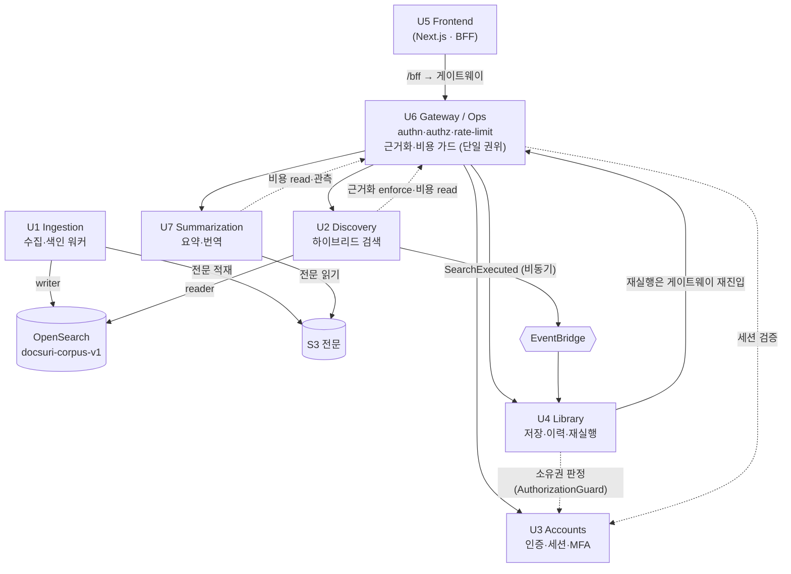

# DocSuri 유닛 파이프라인 문서 (U1~U7)

> 유닛(U1~U7)별 단락으로 구분한다. 각 단락에 **파이프라인 + 스택 요약**이 들어간다.
> 각 단락은 그 유닛의 **대표 경로 1건**(색인 1건 · 검색 1회 · 로그인 1회 · 요약 1회 …)을 끝까지 따라간다.
> 근거: `backend/modules/<unit>/` · `ingestion/` · `frontend/` · `ops/` 실제 코드 + `shared/` 계약 + `aidlc-docs/`.
> 본문의 모든 수치(top_k=150·RRF_K=60·top_n=20·캐시 TTL 등)는 **코드 상수 그대로**다 — 추정값이 아니다.
>
> **읽는 법:** 박스(`╔═╗`) = 한 유닛의 도메인 코어 / `[ ... ]` = 외부 인프라·다른 유닛 / `★` = 폴백·게이트 등 분기점 / 굵은 화살표(`──▶`) = 외부 호출.

## 유닛 한눈에
| 유닛 | 한 줄 | 경로 성격 | 핵심 불변식 |
|---|---|---|---|
| **U1** Ingestion | arXiv 수집·청킹·임베딩·색인 | 비동기 워커 — **처리량** | 단일 **writer** · 멱등 색인 |
| **U2** Discovery | 자연어 하이브리드 검색 | 동기 — **레이턴시**(P50<3s) | 단일 **reader** · 근거화는 U6 |
| **U3** Accounts | 인증·세션·MFA | FastAPI async | 토큰 쿠키 전용 · fail-closed |
| **U4** Library | 저장·이력·재실행 | 동기 CRUD + 이벤트 소비 | owner 스코프 · 백도어 금지 |
| **U5** Frontend | 검색·라이브러리 폰 UI | Next.js BFF | 토큰 브라우저 비노출 |
| **U6** Reliability | 게이트웨이·근거화·비용 가드 | 엣지 미들웨어 + 운영 워커 | 횡단 관심사 **단일 권위** |
| **U7** Summarization | 온디맨드 구조화 요약·번역 | 동기 — 캐시 우선 | 불변 캐시 키 · U7 자체 근거화 |

## 유닛 의존성 그래프

> 실선(`──▶`) = 요청·데이터가 흐르는 방향 / 점선(`-.->`) = 단일 권위를 **호출/조회만**(재구현 안 함) / 원통 = 공유 스토어.
> 읽는 핵심: **U6가 모든 요청의 길목**이고(횡단 관심사 단일 권위), **U1=writer / U2=reader가 같은 인덱스**를 공유한다.



---

# U1 Ingestion

arXiv 수집 · 청킹 · 문서 임베딩 · 색인 (공유 인덱스 단일 **writer**).
**비동기 워커**(레이턴시가 아니라 처리량이 목표 — U2의 동기 경로와 정반대). 아래는 논문 1건 색인 경로.

## 파이프라인

```
  [ 트리거 ]  RefreshOrchestrationService
   · on_schedule_tick (증분, watermark 이후)   · on_new_arxiv_event   · trigger_full_rebuild(락)
   · (U7 read 미스가 enqueue) BUILD_DOC_MODEL 잡 — lazy doc-model 생성
        │  IngestionJob 적재
        ▼
   [ AWS SQS 큐 ]  (rebuild 진행 중이면 증분/이벤트 defer)
        │  worker.py: receive_messages(max 10) → process_message
        │    └ kind=BUILD_DOC_MODEL → build_doc_model · 그 외 → ingest_one
        ▼
╔══════════════ IngestionPipelineService.ingest_one (Python 워커) ══════════════╗
║  공통 복원력: 의존성마다 retry 5회(지수 backoff+jitter) · circuit(5회 실패 OPEN, 60s) · timeout(기본 30s·설정값) ║
║                                                                                ║
║  ① record_job_started ───────────────────────────────▶ [ PostgreSQL 컨트롤플레인 ] ║
║  ② fetch_metadata + fetch_full_text ─────────────────▶ [ arXiv HTTP ]            ║
║  ③ parse (FetchParseProcessor)                                                  ║
║     · 라이선스 allowlist(CC-BY 계열만) 아니면 거부   · title/authors/abstract/category 검증 ║
║     · withdrawal 마커 감지 → tombstone 경로 ─────────▶ [ OpenSearch ] tombstone_paper ║
║  ④ dedup 평가 (paperId·version·fingerprint) ─────────▶ [ PostgreSQL ]            ║
║     · DUPLICATE/STALE → short-circuit 종료                                       ║
║  ⑤ begin_upsert (claim) — 단조 가드(낮은 버전 거부)                               ║
║  ⑥ put_full_text ────────────────────────────────────▶ [ AWS S3 전문 저장 ]      ║
║  ⑦ chunk (Chunker: max 2400자 · overlap 240 · ≤128청크/논문 · 섹션=abstract+본문 헤딩) ║
║  ⑧ embed_documents ──────────────────────────────────▶ [ AWS Bedrock ]          ║
║     Cohere Embed Multilingual v3 · input_type=search_document · 1024-d · cosine   ║
║  ⑨ assemble IndexRecord (chunkId=결정적 upsert키 · lexicalTerms=제목+초록+청크 · 카드필드) ║
║  ⑩ bulk_upsert + delete_stale_chunks(paperId 단위) ──▶ [ OpenSearch docsuri-corpus-v1 ] ║
║  ⑪ mark_ingested · advance_watermark · record_job_finished                      ║
╚══════════════════════════════╪═════════════════════════════════════════════════╝
        │ 성공 → SQS ack                          │ 실패(IngestionError)
        ▼                                         ▼
   다음 메시지                          record_job_finished(success=False) → emit_failure_signal
                                        PERMANENT → [ SQS DLQ ] + ack / RETRIABLE → 미ack(재배달)

  ─────────── 색인 핫패스 밖의 두 갈래 (색인을 절대 막지 않음) ───────────
   ⑩' (선택) dual-write v2  : embedding_v2+vector_index_v2 주입 시 다른 임베딩 모델로 두 번째 인덱스
                              (모델 마이그레이션/AB) — best-effort, 실패=로그만(1차 색인 무영향)
   ⑪  FR-17 assets         : 그림/표 추출 → S3, 인덱스 커밋 *후* best-effort(BR-27)
   별도 잡 BUILD_DOC_MODEL  : build_doc_model — 구조화 doc-model 생성·캐시(결정적, native HTML→ar5iv 폴백)
                              U7 /doc-model 읽기 미스가 enqueue → 여기서 produce (핫패스 비차단, D6/BR-30)
```

## 왜 이렇게 생겼나

**1. 처리량 우선이라 재시도를 많이 한다 (U2와 정반대).**
의존성마다 retry 5회(지수 backoff + jitter) · 서킷(5회 실패 시 OPEN, 60s 후 half-open) · timeout(기본 30s·설정값). 사용자 대면 레이턴시 예산이 없으니 "끈질기게" 처리한다.

**2. 멱등 색인 — 같은 논문을 재처리해도 깨지지 않는다.**
`chunkId`가 결정적이라 OpenSearch upsert 키로 그대로 쓰이고, dedup 가드(paperId·version·fingerprint)가 DUPLICATE/STALE을 short-circuit한다. 낮은 버전은 단조 가드로 거부 → 오래된 재배달이 최신본을 덮지 못한다.

**3. 단일 writer 불변식 — U2와 같은 공간에 쓴다.**
`input_type=search_document`(U2 reader의 `search_query`와 비대칭). 부팅 시 `assert_writer_embedding_role()`로 역할을 강제, specVersion·1024·cosine을 U2와 맞춘다(vector-spec).

**4. 라이선스·철회 게이트 — 색인 전에 거른다.**
오픈액세스 allowlist(CC-BY 계열)만 통과, 철회 마커가 보이면 색인 대신 tombstone으로 인덱스에서 제거.

**5. 실패를 분류해서 처리한다.**
PERMANENT(포이즌·검증 위반)만 DLQ로 격리하고 ack, RETRIABLE은 미ack로 SQS가 재배달. 조용한 유실이 없다.

**6. 무거운 부가 산출물은 색인 핫패스에서 뺀다.**
구조화 doc-model은 색인 때 미리 만들지 않고(핫패스 비차단), U7이 처음 읽을 때 미스가 BUILD_DOC_MODEL 잡을 enqueue하면 워커가 **lazy하게** 생성·캐시한다(D6/BR-30, 결정적). FR-17 그림/표 assets는 인덱스 커밋 *후* best-effort로 저장하고, dual-write v2(2차 임베딩 인덱스)도 실패 시 로그만 — 부가물 어느 것도 1차 색인을 막지 못한다(BR-27).

## 스택 요약

| 레이어 | 기술 | 메모 |
|---|---|---|
| **런타임** | Python 워커 (long-running, SIGTERM drain) | 비동기·처리량 목표, 사용자 경로 밖 |
| **큐** | AWS SQS (+ DLQ) | 외부 인프라 접점 — at-least-once, PERMANENT만 DLQ |
| **소스** | arXiv HTTP | 외부 인프라 접점 — 증분/이벤트/전체 재빌드 |
| **컨트롤 플레인** | PostgreSQL | dedup·watermark·job 상태·rebuild 락 (단조 가드) |
| **전문 저장** | AWS S3 | 외부 인프라 접점 — 원문 보관 |
| **임베딩** | AWS Bedrock — Cohere Embed Multilingual v3 (`search_document`, 1024-d) | 권한 경계 — 단일 writer, U2 reader와 동일 공간 |
| **색인 스토어** | OpenSearch `docsuri-corpus-v1` (+ 선택 v2 인덱스) | 권한 경계 — 단일 writer(U2=단일 reader), v2는 dual-write best-effort |
| **doc-model/assets** | docmodel 빌더(native HTML→ar5iv) · S3 그림/표 | 색인 핫패스 밖 — BUILD_DOC_MODEL 잡(lazy)·assets best-effort, U7이 소비 |
| **복원력** | retry 5회 · circuit(5/60s) · timeout(기본 30s·설정값) | 의존성별 독립, 처리량 자세 |

---

# U2 Discovery

자연어 검색 · 하이브리드(벡터+BM25) 검색 · 근거화 결과 (공유 인덱스 단일 **reader**).

## 파이프라인

```
┌──────────────────────────────────────────────────────────────────────────────────────┐
│  CLIENT          [ U5 폰 앱 — Next.js (App Router) · 폰 목업 UI ]                        │
│                         │  POST /api/search  { "query": "그래프 신경망 추천" }           │
└─────────────────────────┼──────────────────────────────────────────────────────────────┘
                          ▼
┌──────────────────────────────────────────────────────────────────────────────────────┐
│  GATEWAY         [ U6 Gateway ]   authn · authz · rate-limit  ──▶ RequestContext(userId)│
└─────────────────────────┼──────────────────────────────────────────────────────────────┘
                          ▼
╔════════════════════ U2 도메인 코어 (FastAPI · Python · 동기) ═══ NFR-P1: P50 < 3s ═══════╗
║                                                                                          ║
║   plan_and_retrieve()                                          stack / 수치              ║
║  ┌────────────────────────────────────────────────┐                                      ║
║  │ ① VALIDATE / NORMALIZE   QueryValidator         │  NFC · ≤500자 · 제어문자 거부        ║
║  │    실패 → ValidationErrorDTO ─────────────────────────────────────▶ HTTP 400          ║
║  └───────────────────────┬────────────────────────┘                                      ║
║                          ▼                                                                ║
║  ┌────────────────────────────────────────────────┐                                      ║
║  │ ② DEGRADE 파생          CostGuard.getBudgetState│  U6 읽기전용 (U2는 판정 안 함)       ║
║  │    NORMAL / RERANK_OFF / LEXICAL_ONLY           │                                      ║
║  └───────────────────────┬────────────────────────┘                                      ║
║                          ▼                                                                ║
║  ┌────────────────────────────────────────────────┐      ┌──────────────────────────┐    ║
║  │ ③ EXPAND               QueryUnderstandingExpander│─────▶│ EmbeddingCache (TTL=300s) │    ║
║  │    · lexical terms = lower().split()            │ miss │  key=정규화질의           │    ║
║  │    · query embedding (llm_enabled일 때만)       │◀─────│  max=1024, oldest evict   │    ║
║  └───────────────────────┬────────────────────────┘      └─────────────┬────────────┘    ║
║                          │                                              ▼ miss            ║
║                          │                              ┌────────────────────────────┐    ║
║                          │                              │ AWS Bedrock                 │    ║
║                          │                              │ Cohere Embed Multilingual v3│    ║
║                          │                              │ input_type=search_query     │    ║
║                          │                              │ 1024-d · cosine · 정규화     │    ║
║                          │   임베딩 장애                 └────────────────────────────┘    ║
║                          │   EmbeddingUnavailable ──▶ ★폴백: lexical-only (DegradedDTO)    ║
║                          ▼                                                                ║
║  ┌────────────────────────────────────────────────┐                                      ║
║  │ ④ RETRIEVE             HybridRetriever          │                                      ║
║  │                                                 │      ┌──────────────────────────┐    ║
║  │   k-NN 쿼리  ∥  BM25 쿼리   (병렬 발행)          │─────▶│ OpenSearch               │    ║
║  │   각 top_k=150                                  │      │ index: docsuri-corpus-v1 │    ║
║  │        │                                        │◀─────│ ─ vector: knn_vector     │    ║
║  │        ▼                                        │      │     hnsw·cosinesimil·1024│    ║
║  │   RRF 병합   score=Σ 1/(60 + rank + 1)          │      │ ─ lexicalTerms: text(BM25)│    ║
║  │   RRF_K=60 · 점수 스케일 무관                    │      │ (k-NN·BM25 단일 스토어)   │    ║
║  │        ▼                                        │      └──────────────────────────┘    ║
║  │   디덥 (paperId 단위, first-seen)               │  장애 → IndexUnavailable             ║
║  │   정렬 (-score, paperId)                        │        ★fail-closed ─▶ HTTP 503       ║
║  │                                                 │                                      ║
║  │   후보 0건/필터아웃 → 빈 페이지(resultCount=0) ──────────────▶ HTTP 200 (★abstain 아님)║
║  └───────────────────────┬────────────────────────┘                                      ║
║                          ▼                                                                ║
║  ┌────────────────────────────────────────────────┐                                      ║
║  │ ⑤ RANK                 RelevanceRanker          │  sort(-score) → top_n=20 절단        ║
║  │    LLM 리랭킹 없음(baseline) · 안정 정렬          │  (RERANK_OFF는 no-op)               ║
║  └───────────────────────┬────────────────────────┘                                      ║
║                          ▼                                                                ║
║  ┌────────────────────────────────────────────────┐                                      ║
║  │ ⑥ toGroundingInput     GroundingAdapter         │  GroundingInput{후보 + 실재 레코드}  ║
║  └───────────────────────┬────────────────────────┘                                      ║
╚══════════════════════════╪═══════════════════════════════════════════════════════════════╝
                           ▼   ── gateway seam (INV-1) ──
              ┌──────────────────────────────────────────────┐
              │ ★ ENFORCE   [ U6 GroundingEnforcementHook ]   │  ← U2는 절대 직접 호출 안 함
              │   날조 검증 → GroundingDecision(verdict)       │     (단일 호출 지점 = U6)
              └─────────────────────┬────────────────────────┘
                                    ▼
╔══════════════════════════ U2 도메인 코어 (이어서) ═══════════════════════════════════════╗
║   finalize()                                                                             ║
║  ┌────────────────────────────────────────────────┐                                      ║
║  │ ⑦ mapDecision          GroundingAdapter         │  pass → Grounded                     ║
║  │                                                 │  block/abstain → AbstainResult       ║
║  └───────────────────────┬────────────────────────┘                                      ║
║                          ▼                                                                ║
║  ┌────────────────────────────────────────────────┐                                      ║
║  │ ⑧ ASSEMBLE             ResultAssembler          │  카드 7필드만 (SEC-9)                ║
║  │    title·authors·year·arxivId·snippet·          │  relevance=순위(raw 점수 비노출)     ║
║  │    relevance·arxivUrl                           │  저하 시 → DegradedResultDTO(mode)   ║
║  └───────────────────────┬────────────────────────┘                                      ║
║                          ▼                                                                ║
║                  SearchResponse (4종단 중 1) ─────────────────────────────▶ HTTP 200      ║
║                          │                                                                ║
║  ┌───────────────────────┴────────────────────────┐                                      ║
║  │ ⑨ PUBLISH (응답 후 · 비차단 · fire-and-forget)   │  실패해도 응답 무영향                ║
║  └───────────────────────┬────────────────────────┘                                      ║
╚══════════════════════════╪═══════════════════════════════════════════════════════════════╝
                           ▼
              [ AWS EventBridge ]  Source=docsuri.discovery / SearchExecuted
                           ▼
              [ U4 Library ]  SearchHistoryEventConsumer → record_search()
                           ▼
              [ PostgreSQL (RDS) ]  search_history (owner_id·query·executed_at·result_count)

  ─────────── 곁다리: 논문 상세 메타 (U5 상세 페이지 · U7 요약 진입점) ───────────
   GET /api/papers/{paperId}  → PaperMetadataService.get_paper_meta (코퍼스 데이터=U2 소유)
     · paper_service 주입됐을 때만 라우트 등록  · 없으면 404
```

## 왜 이렇게 생겼나

**1. 파이프라인이 ⑥과 ⑦ 사이에서 두 동강 나 있다.**
`plan_and_retrieve()` / `finalize()`로 메서드 자체를 갈라서, U2 코드가 **구조적으로 enforce를 못 부르게** 만들었다. 근거화(날조 검증)는 U6의 단독 권한(INV-1). "검색 엔진과 검열관의 분리"다. 그 틈(gateway seam)에서만 U6가 enforce를 끼워넣는다.

**2. 동기 경로라 재시도를 안 한다 — 갈림길 두 개.**
- 임베딩(Bedrock) 죽으면 → **lexical(BM25)로 폴백** (저하 배너 달고 계속 서비스)
- OpenSearch 죽으면 → **즉시 503** (k-NN·BM25가 한 스토어라 폴백 없음)
P50<3s를 지키려고 "기다리며 재시도" 대신 "빨리 포기/우회"를 택했다(U1 워커가 5회 재시도하는 것과 정반대 — 워커=처리량, U2=레이턴시).

**3. 하이브리드 = 코사인 + BM25를 RRF로 섞는다 (점수 스케일 무관, best-chunk 방식).**
`1/(60+rank+1)`로 **순위만** 더하니까, 0~1짜리 코사인 유사도와 수백짜리 BM25 점수를 직접 더하지 않고 공정하게 합칠 수 있다. 전문을 다(多)청크로 색인하면서 **리스트 안에선 한 논문의 best 청크 기여만(MAX) 쓰고**(약한 본문 청크 다수가 강한 1건을 눌러버리는 길이 편향 차단), 그렇게 고른 k-NN best와 BM25 best를 **리스트 간에 더한다(SUM)**. 그 뒤 `paperId`로 1건(최고점 청크)만 남긴다(디덥). over-fetch(top_k=150)는 다청크 디덥 손실을 메워 top-N을 채우려는 것.

**3b. 무결과와 기권(abstain)은 다른 종단이다.**
검색 결과가 0건이거나 근거화 pass 후 후보가 전부 걸러지면 **빈 성공 페이지**(`resultCount=0`, 배너 없음)다. `AbstainDTO`는 근거화가 **거부(block/abstain)**했을 때만 — "못 찾음(빈 페이지) ≠ 지어낸 것 같아 거부(기권)"를 클라가 구분하게 한다(BR-9 / U5 B3-a).

**4. 임베딩은 검색당 딱 1회 + 캐시 — 비용/레이턴시의 거의 전부.**
LLM 질의 재작성·리랭킹을 안 하므로(Q1=A/Q3=A) U2의 유일한 LLM 비용 동인은 질의 임베딩 1회뿐이고, 그마저 정규화 질의 키로 캐싱(TTL 300s)해 중복 질의를 막는다.

**5. 이력은 던지고 잊는다(fire-and-forget).**
SearchExecuted는 응답 **후** EventBridge로 비동기 발행 → U4 → PostgreSQL. 발행이 실패해도 검색 응답엔 영향 0. 이력 저장이 검색 레이턴시 예산(P50<3s)을 잠식하지 못하게 경계를 그었다.

## 스택 요약

| 레이어 | 기술 | 메모 |
|---|---|---|
| **API** | FastAPI · pydantic v2 · Python 3.12 | 동기 단일 경로, NFR-P1 P50<3s |
| **임베딩** | AWS Bedrock — Cohere Embed Multilingual v3 (1024-d, cosine, `search_query`) | 외부 인프라 접점 — 비용·레이턴시 동인 / 장애 시 lexical 폴백 |
| **캐시** | 인메모리 read-through, TTL 300s, max 1024 (→ Infra: 공유 캐시) | 중복 질의 임베딩 차단 |
| **검색 스토어** | OpenSearch — k-NN(HNSW·cosine·1024) + BM25, 단일 인덱스 `docsuri-corpus-v1`, 각 top_k=150 | 외부 인프라 접점 / 장애 시 503 fail-closed (폴백 없음) |
| **병합** | 앱 레벨 RRF (k=60) — 리스트내 best-chunk(MAX)→리스트간 SUM + paperId 디덥 | 점수 스케일 무관·결정적, 전문 길이 편향 차단 |
| **근거화** | U6 GroundingEnforcementHook (gateway seam 단일 호출) | 권한 경계 — 이 행만 U2 밖(U6), 검색 ≠ 근거화 |
| **이벤트** | AWS EventBridge → U4 → PostgreSQL(RDS) `search_history` | 외부 인프라 접점 — 비동기·비차단, 검색 응답과 분리 |
| **저하 권위** | U6 CostGuardCircuitBreaker (U2는 읽기만) | 권한 경계 — 비용 판정은 U6, U2는 분기만 |

---

# U3 Accounts

인증 · 계정 · 세션 (TOTP · reCAPTCHA · 비밀번호). **FastAPI async**. 아래는 로그인(US-A2) 경로.

## 파이프라인

```
  [ U5 ] ──POST /auth/login { email, password } (+ X-Recaptcha-Token)──▶ [ U6 Gateway ]
                                                                              ▼
╔════════════════ AuthenticationService.authenticate (async) ════════════════╗
║  ① get_by_email ──────────────────────────────────────▶ [ PostgreSQL 계정 ]  ║
║  ② failure_count ≥ 10 → reCAPTCHA 강제 ────────────────▶ [ reCAPTCHA ]        ║
║     실패 → DomainException (fail-closed)                                      ║
║  ③ 비밀번호 비교 (constant-time)                                              ║
║     · Argon2id (m=64MB·t=3·p=4) — CPU 바운드라 asyncio.to_thread (이벤트루프 비차단) ║
║     · 계정 없으면 dummy_hash로 동일시간 비교 (타이밍 공격·부존재 은닉)            ║
║  ④ 실패 시: failure_count++ → 3회차부터 지수 backoff(1·2·4…최대 120s)          ║
║     · asyncio.sleep(비차단) · AuthFailureSignal emit(일반화 reason만) · 401     ║
║  ⑤ status 검증: PENDING(메일 미인증)·LOCKED(관리자 수동) → 거부                  ║
║  ⑥ 성공: failure 통계 리셋 · needs_rehash면 Argon2 재해시                       ║
║  ⑦ Principal(role=DB값 · mfa_verified=False) 생성                              ║
║  ⑧ SessionManager.issue: token_hex(32) ───────────────▶ [ Redis 세션 ]        ║
║     · sliding 2h(idle) · absolute 30d                                         ║
╚══════════════════════════════╪══════════════════════════════════════════════╝
                               ▼
   controller: Set-Cookie session_id (httpOnly · secure · samesite=lax · 30d)
   응답 body = { status, message }  ← 토큰은 body에 없음 (SEC-12)

  ─────────── 이후 요청 인증 (GET /auth/session, /library/*, /api/search) ───────────
   쿠키 session_id ──▶ SessionManager.verify ──▶ [ Redis get ]
     · sliding/absolute 만료 검사 → 갱신   · Redis 장애 → fail-closed(401, DB 폴백 안 함)
     → Principal(role·mfa_verified) 복원

  ─────────── 관리자 제어평면 (BR-A7) ───────────
   /auth/mfa/verify: TOTP 코드 검증 → session elevate_mfa(mfa_verified=True)
   /auth/admin/*: AuthorizationGuard.authorize_admin(role=ADMIN AND mfa_verified) → 아니면 403
```

## 왜 이렇게 생겼나

**1. 세션 토큰은 httpOnly 쿠키로만 — body엔 절대 안 싣는다.**
로그인 응답은 `{status, message}`뿐이고 토큰은 `Set-Cookie`(httpOnly·secure·samesite=lax). XSS로도 토큰을 못 읽는다(SEC-12).

**2. Argon2는 워커 스레드로 — 이벤트 루프를 안 막는다.**
Argon2id(m=64MB)는 수십 ms CPU 바운드라 `asyncio.to_thread`로 위임. 실패 backoff도 `time.sleep`이 아니라 `asyncio.sleep` — 동시 로그인 직렬화/스레드 고갈 DoS를 막는다.

**3. 타이밍 공격·계정 부존재를 숨긴다.**
계정이 없어도 `dummy_hash`로 동일 시간만큼 비교하고, 결과는 강제 False. "이메일이 존재하는지"가 응답 시간으로 새지 않는다.

**4. 자동 계정 잠금을 안 한다.**
실패가 쌓여도 LOCKED로 자동 전환하지 않는다(타인 계정을 겨냥한 DoS가 되니까). 대신 10회차 CAPTCHA + 지수 backoff(최대 120s)로 방어. LOCKED는 관리자 수동 경로만.

**5. Redis 장애 = fail-closed.**
세션 저장소가 죽으면 PostgreSQL로 폴백하지 않고 즉시 거부한다. 만료 검증을 우회하느니 막는 쪽.

**6. 권한 상승 차단.**
ADMIN은 이메일 접두사 같은 사용자 입력으로 절대 안 준다(role은 DB 단일 출처). 관리자 제어평면은 ADMIN 역할 **AND** TOTP MFA 2단계를 통과해야만 접근.

## 스택 요약

| 레이어 | 기술 | 메모 |
|---|---|---|
| **API** | FastAPI (async) · Python | /auth/* 라우터 |
| **계정 저장** | PostgreSQL (CredentialRepository) | 계정·해시·실패 통계 |
| **세션 저장** | Redis (SessionRepository, 풀 싱글톤) | sliding 2h / absolute 30d · 장애 시 fail-closed |
| **비밀번호** | Argon2id (m=64MB·t=3·p=4) | constant-time + 워커 스레드 + 자동 rehash |
| **봇/남용 방어** | reCAPTCHA + 지수 backoff | 10회차 CAPTCHA, 자동 LOCKED 금지 |
| **MFA** | TOTP (관리자 전용, BR-A7) | role=ADMIN AND mfa_verified → 제어평면 |
| **인가** | AuthorizationGuard (단일 권위) | 권한 경계 — deny-by-default, 403 |
| **세션 전달** | httpOnly 쿠키 (secure·samesite=lax) | 권한 경계 — 토큰 body 비노출(SEC-12) |

---

# U4 Library

라이브러리(논문 저장) · 검색 이력 · 저장된 검색. **FastAPI 동기 CRUD + 이벤트 소비자**.
세 갈래: ⓐ CRUD · ⓑ 검색 이력 적재(U2 이벤트) · ⓒ 재실행(게이트웨이 재진입).

## 파이프라인

```
ⓐ CRUD (saved-searches / library / history)  — 동기, owner 스코프
  [ U5 ] ──▶ [ U6 Gateway ] ──(request.state.principal 주입)──▶ controller.get_principal
                                                                  │  없으면 401(fail-closed)
                                                                  ▼
   LibraryService / SavedSearchService / SearchHistoryService
     · library.add: (owner, arxivId) 멱등 · 쿼터 1000/owner · 검증된 meta 스냅샷 보존
     · mutate 시 authorize_owned (U3 AuthorizationGuard) — 타인/부재 → 404 (SEC-9)
     · list: keyset(커서) 페이지네이션 — 오프셋·총건수 없음
                                                                  ▼
   [ PostgreSQL (RDS, SQLAlchemy) ]  saved_searches · library_items · search_history
     (mock-first: InMemoryUserDataRepository — 인프라 없이 mount)

ⓑ 검색 이력 적재  — 비동기, 검색 응답 경로 밖
  [ U2 ] publishSearchExecuted ──▶ [ AWS EventBridge ] ──▶ SearchHistoryEventConsumer.consume
     → record_search (dedupe_key 멱등) ──▶ [ PostgreSQL ] search_history

ⓒ 재실행 (saved-search/history rerun)  — INV-L2 (백도어 금지)
  controller ──▶ SearchGatewayPort.search(query, principal)
     ※ U2 직접 호출 금지 → [ U6 Gateway ] 재진입 → U2 (비용 가드·근거화 enforce 재적용)
     (현재 StubSearchGateway 자리표시 — 실 게이트웨이 결선은 동일 포트 뒤 교체)
```

## 왜 이렇게 생겼나

**1. 모든 쿼리가 owner 스코프 (INV-L1).**
저장된 검색·라이브러리·이력 전부 `owner_id`로 필터. 소유권 판정은 U3 `AuthorizationGuard`에 위임(재구현 안 함).

**2. 타인 리소스는 403이 아니라 404.**
cross-owner/부재는 "권한 없음"이 아니라 "없음"으로 일반화(SEC-9) — 리소스 존재 여부조차 안 흘린다.

**3. 재실행은 U2를 직접 안 부른다 (INV-L2).**
saved-search/history rerun도 게이트웨이로 재진입한다. 그래야 비용 가드와 근거화 enforce가 매 재실행에 다시 적용된다 — 검색 계약을 우회하는 백도어를 막는다.

**4. 검색 응답을 안 막는다.**
이력 적재는 U2의 동기 응답 경로 밖(EventBridge 비동기). `dedupe_key`로 at-least-once 중복을 흡수한다.

**5. 라이브러리는 메타 스냅샷을 보존한다 (BR-L5).**
담을 때의 메타를 검증해 저장 → 원논문이 사라지거나 바뀌어도 카드를 렌더할 수 있다(availability isolation). 추가는 (owner, arxivId) 멱등 + 쿼터 1000/owner.

**6. 목록은 keyset 커서.**
오프셋·총건수 없이 마지막 레코드 기준 커서로 페이지네이션.

## 스택 요약

| 레이어 | 기술 | 메모 |
|---|---|---|
| **API** | FastAPI (동기 CRUD) · 3 라우터 | saved-searches / library / history |
| **저장소** | PostgreSQL (RDS, SQLAlchemy) / InMemory(mock) | keyset 커서, 1:1 마이그레이션 매핑 |
| **인가** | U3 AuthorizationGuard (위임) | 권한 경계 — owner 스코프(INV-L1), 타인→404 |
| **이력 입력** | AWS EventBridge → SearchHistoryEventConsumer | 외부 인프라 접점 — 비동기, dedupe_key 멱등 |
| **재실행** | SearchGatewayPort → U6 Gateway → U2 | 권한 경계 — 백도어 금지(INV-L2), 비용·근거화 재적용 |
| **무결성** | meta 스냅샷 · (owner,arxivId) 멱등 · 쿼터 1000 | availability isolation |

---

# U5 Frontend

검색 화면(히어로) · 라이브러리/이력/저장된 검색 · 폰 목업 UI.
**실측 스택: Next.js(App Router) · React · TypeScript** (※ "React Native"가 아니라 폰 목업으로 렌더하는 웹 앱).
아래는 **검색(hero) 경로** — U2까지 어떻게 도달하는지.

## 파이프라인

```
┌──────────────────────────────────────────────────────────────────────────────────────┐
│  BROWSER (Client Component)   [ SearchScreen.tsx ]                                       │
│   상태기계: idle → loading → outcome | error    in-flight 락(useRef · 중복 제출 차단)     │
│   ① validateQuery(): NFC + trim · ≤500자 (클라 검증 = UX 보조 · 권위는 백엔드)            │
│       실패 → inlineError 표시 (요청 미전송)                                              │
└─────────────────────────┼──────────────────────────────────────────────────────────────┘
                          ▼  getApiClient().search(query)
┌──────────────────────────────────────────────────────────────────────────────────────┐
│  ApiClient.search()   [ lib/api/apiClient.ts ]   — 백엔드 단일 진입점                    │
│   POST /api/search { query } · idempotent=true                                          │
│   정책: timeout=8000ms · 5xx 재시도 2회(backoff 200ms×i) · in-flight dedup(키 단위)       │
│   200/400 → classify · 그 외 → normalizeHttpError(UserFacingError)                       │
└─────────────────────────┼──────────────────────────────────────────────────────────────┘
                          ▼  Transport.send()  (팩토리가 빌드 플래그로 선택)
            ┌─────────────────────────────────────┬─────────────────────────────────────┐
            ▼ NEXT_PUBLIC_DOCSURI_REAL_API 설정 시   ▼ (기본값 = mock)
   ┌──────────────────────────────────┐    ┌──────────────────────────────────┐
   │ RouteHandlerTransport            │    │ MockTransport                    │
   │ fetch /bff/api/search (동일 출처) │    │ 인-브라우저 픽스처(searchFixtures)│
   │ credentials=same-origin·no-store │    │ → 즉시 SearchResponse 반환        │
   │ httpOnly 세션 쿠키 자동 첨부       │    └──────────────────────────────────┘
   └────────────────┬─────────────────┘
                    ▼
╔══════════════ BFF (Next 서버)  [ app/bff/[...path]/route.ts ] ════════════════════════╗
║  서버 전용 seam — 게이트웨이 URL·세션 쿠키는 여기서만 보인다 (SEC-3/12)                  ║
║   DOCSURI_GATEWAY_URL 있음 → HttpTransport (server-only · 쿠키 헤더 전달)               ║
║   없음               → MockTransport (인프라 없이 프리뷰)                                ║
║   업스트림 Set-Cookie를 브라우저로 릴레이                                                ║
╚═════════════════════════╪══════════════════════════════════════════════════════════════╝
                          ▼  HttpTransport.send() · cache no-store · cookie 헤더 전달
              [ U6 Gateway ]  authn · authz · rate-limit
                          ▼
              [ U2 Discovery ]  ← 위 U2 파이프라인 그대로
                          │  SearchResponse (4종단)
                          ▼
┌──────────────────────────────────────────────────────────────────────────────────────┐
│  classifySearchResponse()   [ lib/api/classify.ts ] — 구조로 union 판별(판별 필드 없음)  │
│   { reason } → abstain          { cards, meta, mode } → degraded                         │
│   { cards, meta } → page (meta.resultCount=0 이면 empty)     { message } → invalid       │
└─────────────────────────┼──────────────────────────────────────────────────────────────┘
                          ▼  SearchOutcome
┌──────────────────────────────────────────────────────────────────────────────────────┐
│  SearchScreen 렌더 분기                                                                  │
│   page → ResultList · degraded → ResultList(저하 배너) · empty/abstain/invalid → StateView│
│   에러: 401(auth) → /login?redirect=/search · 그 외 → StateView(error) + 재시도          │
└──────────────────────────────────────────────────────────────────────────────────────┘

  ─────────── 곁다리: U7 상세/요약 슬라이스 (카드 클릭 → /paper/[id]) ───────────
   app/paper/[id]/page.tsx  SSR 셸(AppHeader) + 클라 island(PaperDetailIsland) · RouteGuard 보호
     ├ usePaperMeta → ApiClient.getPaperMeta → [U2] GET /api/papers/{id}  (실패=null → arXiv 링크아웃 degrade)
     ├ sticky 액션바(요약·초록번역·각주트리) → SummaryModal(해당 탭)
     │    useSummarize(상태기계 + inFlight dedup + stale 가드) → POST /api/summarize
     │      → classifySummarizeResponse  ★status 판별자로 분기 (검색은 구조 판별 — 대비점)
     │         ok+summary → SummaryView · ok+translation → TranslationView
     │         pending(retryAfterMs 폴링) · abstain · cost_degraded · source_unavailable · invalid/error
     ├ 본문 라우트 /paper/[id]/doc-model  useDocModel/useAssets → [U7] GET .../doc-model · /assets
     │      기본 OFF→license_unavailable · 미스→building(폴링) · DocModelViewer 렌더  ← 옛 full-text 대체
     └ 전문 번역 /paper/[id]/translate (FullTranslationIsland) · 개인 용어집 GlossaryTermBadge → GET/POST /api/glossary
```

## 왜 이렇게 생겼나

**1. 토큰은 브라우저 JS에 절대 안 들어온다 — BFF가 방화벽.**
클라이언트(`RouteHandlerTransport`)는 항상 동일 출처 `/bff/*`로만 보낸다. 게이트웨이 URL과 httpOnly 세션 쿠키는 **Next 서버(BFF)에서만** 보이고(`httpTransport.ts`는 `import 'server-only'`로 클라 번들 유입 시 빌드 에러), BFF가 서버↔게이트웨이 구간에서만 쿠키를 전달한다(SEC-3/12).

**2. mock ↔ real 교체가 컴포넌트를 안 건드린다.**
화면·`ApiClient`는 그대로 두고 **Transport만** 바꾼다. 빌드 플래그(`NEXT_PUBLIC_DOCSURI_REAL_API`)로 mock/real, BFF 안에선 `DOCSURI_GATEWAY_URL` 유무로 실게이트웨이/mock. 인프라 없이도 프리뷰가 돈다.

**3. 응답 union을 "구조"로 가른다 — 판별 필드가 없으니까.**
`SearchResponse`엔 discriminant가 없어서 `classify.ts`가 키 모양으로 분기한다(`{reason}`→abstain, `{cards,meta,mode}`→degraded, `{cards,meta}`→page/empty, `{message}`→invalid). DTO가 `additionalProperties:false`라 모양이 안 겹친다.

**4. 검색은 한 번에 한 요청 — in-flight 락 + dedup 이중.**
`SearchScreen`이 `useRef`로 제출을 잠그고, `ApiClient`가 idempotent 요청을 키 단위로 dedup한다. timeout 8s, 5xx만 2회 재시도(멱등 한정) — 사용자 대면이라 무한 로딩을 막는다.

**5. 실패는 fail-closed로 일반화한다.**
HTTP 상태 → `UserFacingError`(auth/forbidden/rateLimited/server/network)로 정규화, 비기술 메시지만 노출(SEC-15). 401만 특별 취급 → 재로그인 라우팅.

## 스택 요약

| 레이어 | 기술 | 메모 |
|---|---|---|
| **프레임워크** | Next.js (App Router) · React · TypeScript | 폰 목업 UI(PhoneMockupFrame), 모바일 우선 |
| **화면/상태** | SearchScreen 클라이언트 상태기계 + in-flight 락(useRef) | idle / loading / outcome / error |
| **클라 검증** | validateQuery — NFC · trim · ≤500자 | UX 보조 — 권위는 백엔드(U2/U6) |
| **API 클라이언트** | ApiClient (백엔드 단일 진입점) | timeout 8s · 5xx 재시도 2회 · in-flight dedup |
| **Transport** | MockTransport / RouteHandlerTransport / HttpTransport | mock↔real = 설정 스위치, 컴포넌트 불변 |
| **BFF** | Next route handler `/bff/[...path]` (서버) | 권한 경계 — 게이트웨이 URL·세션 쿠키 서버 전용(SEC-3/12) |
| **응답 분류** | classifySearchResponse | 구조 기반 union 판별 → SearchOutcome 5종 |
| **U7 상세/요약 슬라이스** | /paper/[id](+/doc-model·/translate) · PaperDetailIsland · usePaperMeta/useSummarize/useDocModel/useAssets/useGlossaryTerms | 같은 BFF 골격 재사용 — 상세메타=U2, 요약/번역/doc-model/assets=U7 |
| **summarize 분류** | classifySummarizeResponse | **status 판별자** 기반(검색=구조 기반과 대비) |
| **에러** | UserFacingError | 401→재로그인, fail-closed 비기술 메시지(SEC-15) |

---

# U6 Reliability / Ops

게이트웨이(authn·authz·rate-limit) · 근거화 enforce · 비용 서킷 · 신뢰성.
두 반쪽: ⓐ **요청 엣지 게이트웨이**(동기 미들웨어) · ⓑ **운영 워커/단일 권위**(비동기).

## 파이프라인

```
ⓐ 요청 엣지 — install_gateway_middleware (모든 백엔드 요청을 감싼다)   ※ 현재 구현 그대로
  [ U5/BFF ] ──▶ ┌────────────────────────────────────────────────────────┐
                 │ ① request_id 부여 (X-Request-ID) → request.state.context  │
                 │ ② rate limit (sliding window, 60/60s)                     │
                 │     키 = 신뢰 프록시 hop (X-Forwarded-For 왼쪽=조작가능 무시) │
                 │     초과 → 429                                            │
                 │ ③ call_next → 도메인 모듈(U2/U3/U4)                        │
                 │ ④ 예외 → 일반화 500 (스택 비노출, fail-closed)             │
                 │ ⑤ security headers + X-Request-ID 부착 (+ CORS)           │
                 └────────────────────────────────────────────────────────┘
  ②.5 auth 주입 (backend/middleware/auth.py) — 세션 쿠키 → U3 session_manager.verify → request.state.principal
     · public(/auth/login·/health…) 건너뜀 · optional(/api/search·/auth/session) 있으면 심고 통과
     · 그 외(/library/*) 없거나 검증 실패 → 401 · Redis 장애 → 401 fail-closed
     · ⚠ session_manager 주입 시(=REDIS_HOST 설정)에만 동작; 미설정(로컬/테스트)이면 건너뛰고 U2는 dev 헤더 X-User-Id 폴백.

ⓑ 단일 권위 컴포넌트 (다른 유닛은 호출/조회만, 재구현 금지)

  GroundingEnforcementHook.enforce(candidate, retrieved)
     ※ 호출 위치 = discovery 라우터의 gateway_seam(게이트웨이 post-handler 대역).
       hook 자체는 app-shell이 주입하는 진짜 ops 단일 권위(U2는 직접 호출 안 함, INV-1).
     · candidate 참조(arxivId·paperId·arxivUrl) ⊆ retrieved 레코드 ?
     · 날조 참조 있음 → verdict=block   · 후보/레코드 없음 → abstain   · 전부 실재 → pass
     · (식별자 정규화: arxiv URL/버전 vN 제거 후 비교)

  CostGuardCircuitBreaker  ← U2 등은 getBudgetState 조회만
     · record_spend(event) — event_id 멱등 누적   · cap = $1600
     · ratio = spend/cap →  degrade_mode:  ≥0.80 RERANK_OFF · ≥0.95 LEXICAL_ONLY · <0.80 NORMAL
     ·                      circuit:        ≥0.80 HALF_OPEN · ≥1.0 OPEN

  운영 워커 (ops/worker.py)  ← 비동기 텔레메트리 소비
     [ 텔레메트리 소스(SQS) ] ──▶ AiIncidentDetectorSuite.evaluate ──▶ IncidentEventPublisher
        · 인시던트 후보 발행 성공해야 ack (at-least-once) · 실패 → 미ack 재배달
```

## 왜 이렇게 생겼나

**1. 횡단 관심사를 한 곳에 모았다 (단일 권위).**
authn·authz, rate-limit, 근거화 enforce, 비용 가드를 전부 U6가 소유한다. U2/U3/U4는 호출하거나 조회만 하고 재구현하지 않는다 — 정책이 한 군데서만 바뀐다.

**2. 근거화는 응답 엣지에서 단 한 번.**
U2가 만든 candidate의 참조(arxivId/paperId/arxivUrl)가 retrieved 레코드에 실재하는지 검증 → 날조면 block, 전부 실재면 pass, 후보/레코드가 없으면 abstain. 식별자는 URL·버전(vN)을 벗겨 정규화해 비교한다. (현재 호출 위치는 discovery 라우터의 seam — 게이트웨이 post-handler 대역 — 이고, hook은 app-shell이 주입하는 진짜 ops 단일 권위다.)

**3. 비용은 비율로 단계적으로 죈다.**
cap $1600 대비 spend 비율로 `NORMAL → RERANK_OFF(0.80) → LEXICAL_ONLY(0.95) → OPEN(1.0)`. `record_spend`는 `event_id` 멱등이라 같은 사용 이벤트가 두 번 와도 중복 합산이 없다. U2는 이 `degrade_mode`를 **읽기만** 한다.

**4. rate-limit 키를 위조 못 하게 한다.**
`X-Forwarded-For`의 왼쪽 값은 클라가 조작 가능 → 무시. 우리 프록시가 찍은 오른쪽에서 `trusted_proxy_count`번째 hop만 신뢰하고, 유효 IP가 아니면 버킷을 안 만든다.

**5. 전역 fail-closed.**
미처리 예외는 스택·내부 식별자 없이 일반화 500으로, 모든 응답에 보안 헤더와 `X-Request-ID`(상관용)를 붙인다.

**6. 인시던트는 at-least-once.**
운영 워커는 인시던트 후보를 발행에 성공해야 소스를 ack한다. 발행 실패 시 미ack로 재배달 → 조용한 유실이 없다.

## 스택 요약

| 레이어 | 기술 | 메모 |
|---|---|---|
| **게이트웨이** | FastAPI 미들웨어 (요청 엣지) | request_id · rate-limit · 예외 일반화 · 보안 헤더 · CORS |
| **authn/authz** | 게이트웨이 미들웨어 (backend/middleware/auth.py) | 세션 쿠키→U3 verify→principal 주입(결선됨). REDIS_HOST 미설정 시 건너뜀(dev=X-User-Id 폴백) |
| **rate limit** | InMemoryRateLimiter — 슬라이딩 윈도우(60req/60s) | 신뢰 프록시 hop 키, 초과 429 |
| **근거화** | GroundingEnforcementHook.enforce (ops 단일 권위) | 권한 경계 — 호출 위치=discovery seam(post-handler 대역), 날조 block |
| **비용 가드** | CostGuardCircuitBreaker (cap $1600) | 권한 경계 — 0.80/0.95/1.0 임계, event_id 멱등 |
| **운영 워커** | Python 비동기 (ops/) · 텔레메트리→인시던트 | 외부 인프라 접점 — SQS, at-least-once |
| **관측성** | 구조화 로그 · X-Request-ID 상관 | fail-closed, 스택 비노출 |
| **IaC** | AWS CDK (ops/cdk) | network·compute·access·ingestion·search·summarization·frontend 스택 (+ v2 인덱스 마이그레이션) |

---

# U7 Summarization

논문 카드의 **온디맨드 액션** — 구조화 요약 · 초록/전문 번역 (FR-12/13). **FastAPI 동기 · 캐시 우선**.
LLM을 부르는 유일한 사용자 경로라 비용이 핵심 — 그래서 파이프라인 전체가 **"LLM 지출을 어떻게 안 하느냐"** 로 설계됐다(캐시 HIT·비용 게이트·근거화 abstain 셋 다 LLM을 건너뛴다). 아래는 요약 1건 경로.

## 파이프라인

```
  [ U5 상세 페이지 ]  "요약" / "초록·전문 번역" 탭(모달) · 리치 뷰
   POST /api/summarize { task, paperId, version, persona:"expert", targetLang:"ko", scope, abstract? }
        │
        ▼
  [ U6 게이트웨이 ]  authn · authz · rate-limit(비용 기능 = 남용 방어)  ──▶ principal 주입
        │
        ▼
  router.summarize:  principal user_id 없음 → 401  ·  payload 검증 실패(SEC-5) → 400(message)
                     parse → SummaryRequest  ──▶ gateway_seam.run_summarization
                     (seam = 얇은 진입점, 예기치 못한 예외는 전부 fail-closed → Abstain("unavailable"))
        │
        ▼
╔════════ SummarizationOrchestrationService.run (allow_enqueue=True=API · False=워커) ═══════════╗
║                                                                                                ║
║  ⓪ CACHE LOOKUP (read-through)                                                                 ║
║     key=(paperId·version·task·lang·scope·persona·glossaryVer·[ownerId]·modelVer·promptVer)     ║
║         ← 불변 10차원. scope:summary=FULL고정 · persona:translate=EXPERT핀(BR-S10)             ║
║         ownerId: glossaryVer>0(개인화)일 때만 set, ver0 베이스라인은 공유                      ║
║     ★ HIT → cached=true 즉시 반환(LLM 0회) ─▶ [ Redis sum:* TTL24h ] → miss → [ S3 summaries/ ]║
║        │ miss                                                                                  ║
║  ① COST GATE  U6 CostGuard.get_budget_state(읽기만) ── LLM 지출 직전                           ║
║     ★ degrade_mode≠normal OR circuit=OPEN → CostDegradedDTO("AI 요약 일시 중단", 200)          ║
║        │                                                                                       ║
║  ② SOURCE SELECT(D2)  doc-model(S3) → 없으면 레거시 전문(S3) → 없으면 ★초록 폴백               ║
║     translate scope=abstract → 초록 · ★ 모두 없음 → SourceUnavailableDTO                       ║
║        │                                                                                       ║
║  ③ REFINE  refine_source: doc-model이면 섹션/표/수식 직접 / 평문이면 레거시 regex              ║
║     제거 references·페이지번호·copyright·소속 / 보존 캡션·수식·Appendix (토큰≈len/4)           ║
║        │                                                                                       ║
║  ④ LENGTH ROUTE  ≤40K SINGLE · 40~120K MAP_REDUCE · >120K Abstain("input_too_long")            ║
║     MAP_REDUCE: 게이트 OFF→too_long / ON+잡큐→enqueue→★PendingDTO(retryAfterMs)                ║
║                 (워커가 allow_enqueue=False로 인라인 재실행) ─▶ [ SQS 잡큐 ]                   ║
║        │                                                                                       ║
║  ⑤ GLOSSARY  seed keep-as-is 19 + 매핑 4 ∪ personal ─▶ [ RDS 용어집 (glossaryVer 카운터) ]     ║
║        │                                                                                       ║
║  ⑥ GENERATE (스트림 버퍼링) ─▶ [ AWS Bedrock ]                                                 ║
║     요약 SINGLE→bedrock_llm · MAP_REDUCE→map_reduce 요약기   summary=Claude Sonnet 4.6         ║
║     번역→structured_translator(doc-model→번역 doc-model)     translate=Claude Haiku 4.5        ║
║     프롬프트: system 지시 ↔ <paper> 데이터 분리(injection 방어)                                ║
║        │                                                                                       ║
║  ⑦ GROUNDING VALIDATE  ★요약 전용 결정적 게이트(U6 enforce 아님 · Option D)                    ║
║     anchor=SOFT(미검증 span은 drop→kept_anchors) · 수치(95.3%↔0.953)/스키마/잘림=HARD          ║
║     ★ HARD 위반 → 1회 retry → 또 실패 → Abstain("insufficient_grounding")                      ║
║     (번역엔 게이트 없음: 한 필드라도 실제 번역됐는지 검사 → 실패 Abstain("empty_translation")) ║
║        │ pass                                                                                  ║
║  ⑧ ASSEMBLE → SummaryResultDTO  SEC-9 화이트리스트(tokens·cost·cacheKey·modelId 비노출)        ║
║     요약 tldr·contributions·method·results·limitations·reproducibility{code,data}·anchors(kept)║
║     번역 번역된 doc-model (+ 사용자 선호 단순명사 후치환)                                      ║
║        │                                                                                       ║
║  ⑨ WRITE-THROUGH  store.put → S3 먼저(durable) → Redis 백필(TTL24h)                            ║
║  ⑩ EMIT TELEMETRY (비차단·절대 raise 안 함) ─▶ U6 ObservabilityHub                             ║
║        │                                                                                       ║
║     SummaryResponse (5종단 중 1) ──────────────────────────────────────────────▶ HTTP 200      ║
║     ok · pending · abstain · cost_degraded · source_unavailable                                ║
╚════════════════════════════════════════════════════════════════════════════════════════════════╝

  ─────────── 곁다리 엔드포인트 (라우터에서 주입/OA 게이트, 전부 fail-closed) ───────────
   GET/POST /api/glossary           개인 용어집(owner-scoped) 목록/upsert(성공 시 glossaryVer++)
   GET /api/papers/{id}/doc-model   구조화 doc-model(리치뷰/요약입력) · 기본 OFF→license_unavailable
                                    · 미스 → U1 lazy 빌드 트리거 → building(폴링) · URL-free(SEC-9)
   GET /api/papers/{id}/assets      그림/표 매니페스트(FR-17) · 기본 OFF · 서명 URL만(SEC-9)
     (※ 이전 단일 .../full-text 는 doc-model + assets 두 갈래로 대체됨)
```

## 왜 이렇게 생겼나

**1. 캐시 키가 곧 "동일성"의 전부 — 같은 키 = 영구히 같은 산출물.**
키는 10차원(paper·version·task·lang·scope·persona·glossaryVer·[ownerId]·modelVer·promptVer)이고 **불변**이다(INV-5). 그래서 캐시 HIT이면 LLM을 **0회** 부르고 즉시 반환한다. scope는 summary면 `FULL` 고정, persona는 translate면 `EXPERT`로 핀(BR-S10 — persona-agnostic 작업에 중복 캐시 방지). 개인화 산출물(`glossaryVer>0`)은 `ownerId`까지 키에 넣는다 — `glossaryVer`는 사용자별 카운터라 서로 다른 사용자가 같은 ver를 가질 수 있어, owner 스코프가 없으면 남의 개인 번역이 서빙될 수 있어서다. 베이스라인(ver0, 개인 용어 없음)은 owner-agnostic이라 사용자끼리 **공유**. `promptVer`/`modelVer`를 올리면 파생 객체가 전부 자동 무효화된다.

**2. 비용 게이트가 LLM 지출 "직전"에 선다 (U6 단일 권위, 읽기만).**
`degrade_mode`가 normal이 아니거나 서킷이 OPEN이면 — 소스를 읽기도 전에 — `CostDegradedDTO`("AI 요약 일시 중단")로 끊는다(BR-S13). 비용 판정은 U6가 소유하고 U7은 **읽기만** 한다(U2와 동일 규약). 캐시 HIT은 이 게이트보다 앞이라, 비용이 묶여 있어도 이미 만든 요약은 계속 나간다.

**3. 근거화는 U7이 직접 소유한다 — U6의 enforce와 다른 종류의 검사다. (Option D: soft anchor)**
U6 enforce는 "검색 후보의 식별자 ⊆ 검색된 레코드 집합"(SET 멤버십)을 본다. U7은 "요약문 ⊆ 한 논문의 원문"(문서 충실도)을 본다 — 그래서 "근거화 단일 권위 = U6"는 *검색 근거화에 한정*으로 읽고, 요약 근거화는 U7이 가진다(Q4). **전부 결정적**(LLM-judge 없음, Q15)이되 검사마다 강도가 다르다: **anchor 존재는 SOFT** — 원문에 verbatim으로 없는 anchor(표 재렌더·패러프레이즈·LaTeX↔유니코드 수식)는 abstain이 아니라 **drop**하고 통과한 것만 `kept_anchors`로 남긴다. **수치 일치·스키마·잘림은 HARD** — hard 위반이면 1회 retry 후 fail-closed abstain(`insufficient_grounding`, INV-4). 검증 못 한 포인터를 떨궈도 수치가 hard라 날조는 안 새고, 멀쩡한 요약을 통째로 버리지 않는다. 단 이 게이트는 **요약 경로 전용**이다 — 번역은 "한 필드라도 실제 번역됐는가"만 보고, 아니면 retry 후 `AbstainDTO("empty_translation")`.

**4. 저하/대기를 종류별로 구분해 각각 다른 종단을 준다.**
비용(`CostDegradedDTO`) · 대기(긴 입력 → 백그라운드 잡 → `PendingDTO(retryAfterMs)`, 클라가 폴링) · 장애(LLM 2회 실패 → `AbstainDTO`) · 입력 초과(`input_too_long`) · 소스 없음(`SourceUnavailableDTO`)을 섞지 않는다(nfr §1.3). 클라가 "잠깐 막힘 / 처리 중 / 못 만듦 / 너무 김 / 원문 없음"을 구분해 다르게 안내할 수 있다.

**5. 정제는 보수적이다 — 결과 수치를 지우지 않으려고.**
references·페이지번호·copyright·소속처럼 **명백한** 잡음만 제거하고, Table/Figure 캡션·수식·Appendix는 보존한다(Q2). 초록엔 잘 안 나오는 결과 수치·재현성이 본문/표에 있어서다. 과다 제거가 곧 근거화 실패로 이어지니 "덜 지우는" 쪽으로 기울였다.

**6. buffer-validate-then-render — 검증 끝난 결과만 노출한다.**
스트리밍처럼 보여도 도메인은 토큰 스트림을 내부에서 받아 **완성 JSON으로 버퍼링**한 뒤 검증한다(BR-S8). 토큰을 흘려보내며 렌더하면 근거화 미통과 문장이 새어 나갈 수 있어서(FR-5), 점진적 렌더는 이미 검증된 필드를 클라가 단계적으로 그리는 **표현 계층**의 일이다.

**9. 긴 논문은 동기 응답을 막지 않는다 — map-reduce + 비동기 잡.**
40K~120K 토큰(MAP_REDUCE 밴드)은 게이트(`DOCSURI_MAP_REDUCE_ENABLED`)가 켜져 있으면 백그라운드 SQS 잡으로 enqueue하고 즉시 `PendingDTO(retryAfterMs)`를 돌려준다. 워커(`worker.py`)가 `allow_enqueue=False`로 같은 파이프라인을 재실행해 섹션 인식 map-reduce(요약)·섹션 map-only(번역)를 인라인 처리하고, 클라는 폴링하다 캐시 히트로 결과를 받는다. 게이트 OFF면 그 밴드는 `input_too_long`으로 abstain(이전 동작 보존).

**10. 전문 접근은 doc-model + assets 두 갈래다.**
이전 단일 `/full-text` 대신 **구조화 doc-model**(리치 뷰·요약 입력, URL-free)과 **assets 매니페스트**(그림/표 서명 URL, SEC-9)로 나뉜다. doc-model 미스 시 U1의 lazy 빌드를 트리거하고 `building`으로 폴링을 유도(빌드는 U1 몫, U7은 큐잉만). 둘 다 기본 OFF(OA 운영 토글)이고, 개인 용어집 CRUD(`GET/POST /api/glossary`)도 같은 라우터에 owner-scoped로 붙는다.

**7. 프롬프트는 지시/데이터를 물리적으로 가른다 (injection 방어).**
system 지시와 논문 본문을 분리하고, 본문은 `<paper>` 태그로 감싸 "이 안은 데이터이지 지시가 아니다"라고 못 박는다. 외부 텍스트(논문)가 프롬프트를 탈취하지 못하게 한다.

**8. 용어집은 두 경로 — 프롬프트 강제 + 후치환.**
핵심 용어(attention→어텐션 등)는 **프롬프트에서 강제**하고, 사용자 선호 단순명사는 생성 후 **결정적 후치환**으로 바꾼다(LLM 재호출 없음). 후치환은 단순명사로만 한정하고 왼쪽 경계만 매칭해 한국어 조사("어텐션을/어텐션이")가 깨지지 않게 한다(Q8).

## 스택 요약

| 레이어 | 기술 | 메모 |
|---|---|---|
| **API** | FastAPI · POST /api/summarize · GET/POST /api/glossary · GET /papers/{id}/doc-model · /assets | 비용 기능 — rate-limit은 U6, 입력검증 SEC-5 |
| **요약 LLM** | AWS Bedrock — Claude Sonnet 4.6 (`global.anthropic.claude-sonnet-4-6`) | 외부 인프라 접점 — SINGLE 1회 / 긴 입력 map-reduce |
| **번역 LLM** | AWS Bedrock — Claude Haiku 4.5 (`global.anthropic.claude-haiku-4-5-20251001-v1:0`) | 외부 인프라 접점 — 구조화 doc-model 번역, 저비용 |
| **긴 입력** | map_reduce 요약기 / structured_translator + 비동기 잡(SQS) | MAP_REDUCE 밴드 — Pending→폴링, 게이트 OFF면 abstain |
| **캐시(hot)** | Redis `sum:` 키스페이스, TTL 24h | 미스 시 S3 백필 — 만료 없는 키 금지 |
| **저장(영구)** | AWS S3 `summaries/` — 불변 키(`object_path`) | durable truth, 동일 키 = 영구 동일 산출물(INV-5) |
| **소스** | AWS S3 — doc-model → 레거시 전문 → 초록 (U1 적재) | doc-model 우선, 없으면 단계적 폴백(NFR-R2) |
| **용어집** | PostgreSQL (RDS) — seed ∪ personal, glossaryVer 카운터 | 개인화(ver>0)는 ownerId로 캐시 스코프 |
| **근거화** | GroundingValidator (U7 자체 · 결정적 · Option D) | 권한 경계 — anchor SOFT(drop)·수치/스키마 HARD, LLM-judge 없음 |
| **비용 가드** | U6 CostGuardCircuitBreaker (읽기만) | 권한 경계 — LLM 지출 직전 게이트, 판정은 U6 |
| **관측성** | U6 ObservabilityHub (비차단 emit) | 응답 경로 밖 — telemetry는 절대 raise 안 함 |
| **모델 ID 버전** | `model_ver=sonnet46-haiku45` · `prompt_ver=p1` | 캐시 키 일부 — 바꾸면 전체 무효화 |
| **마운트** | real-first — S3/RDS 설정됐을 때만 마운트(mock 결선 없음) | 미설정 → skip(fail-closed, 무음 폴백 없음) |
